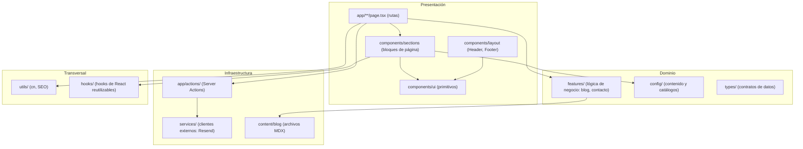
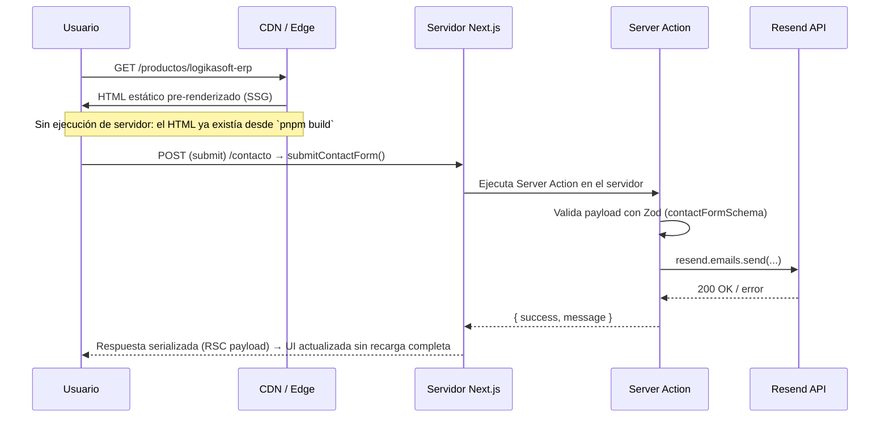
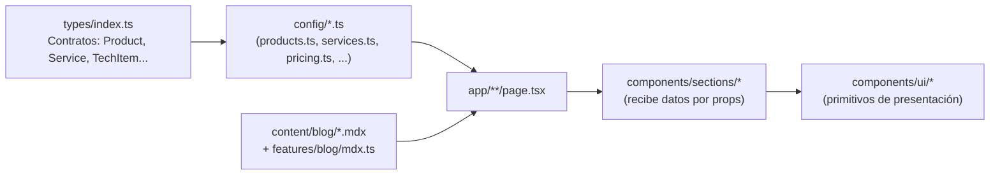
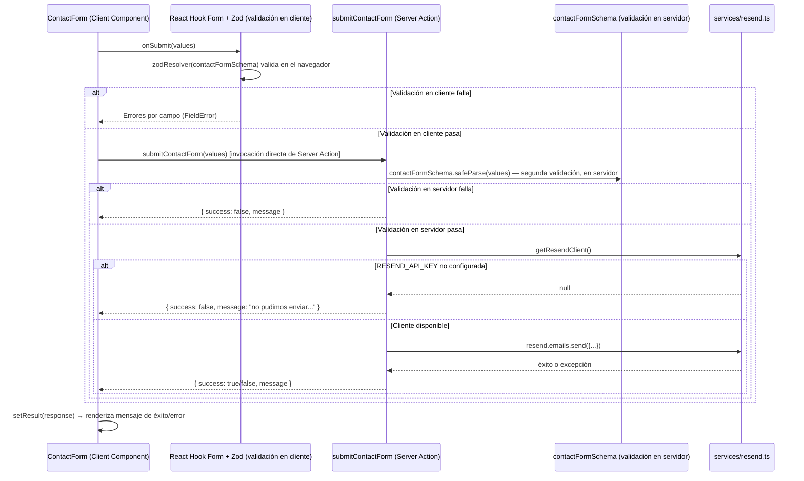
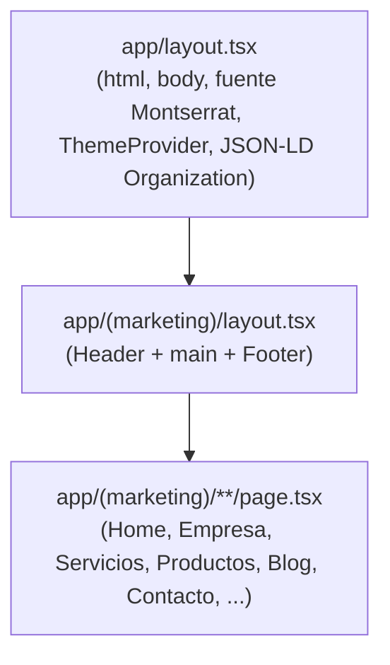
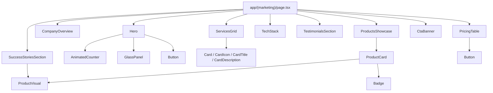
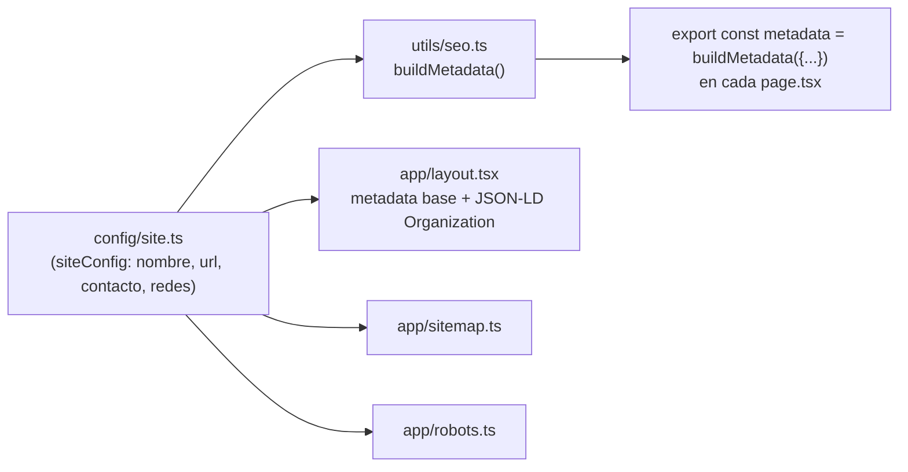

# Arquitectura de Software

## 1. Visión general

El sitio de LOGIKA SOFT es una aplicación **Next.js 16** construida sobre el **App Router**, siguiendo un modelo de **arquitectura en capas** inspirado en *Clean Architecture*, adaptado a las particularidades de un proyecto Next.js orientado a marketing/contenido:



**Regla de dependencia:** las capas superiores (Presentación) dependen de las inferiores (Dominio, Infraestructura), nunca al revés. Un componente de `components/ui` **nunca** importa de `config/` ni de `features/`; en cambio, `components/sections` sí puede leer de `config/` para poblarse de datos por defecto, aunque el patrón preferido es que la **página** (`app/**/page.tsx`) lea los datos y los pase como *props* a la sección.

---

## 2. Modelo de renderizado

Next.js con el App Router permite mezclar, dentro del mismo árbol de componentes, distintas estrategias de renderizado. El proyecto usa deliberadamente una combinación de **SSG (Static Site Generation)** y **Server/Client Components**, y **no usa SSR dinámico ni ISR con revalidación por tiempo** en su forma actual, ya que todo el contenido (productos, servicios, artículos de blog) es contenido versionado en el propio repositorio, no datos que cambien entre despliegues.

| Estrategia | ¿Se usa? | Dónde | Por qué |
|---|---|---|---|
| **SSG** (`○ Static`) | Sí — es el modo por defecto de todas las páginas | `/`, `/empresa`, `/servicios`, `/productos`, `/blog`, `/contacto`, etc. | Todo el contenido es conocido en build time (vive en `config/*.ts` y `content/blog/*.mdx`), por lo que Next.js pre-renderiza el HTML completo durante `pnpm build`. Resultado: TTFB mínimo, cero carga al servidor por visita, cacheable en CDN. |
| **SSG con rutas dinámicas** (`● SSG`) | Sí | `/productos/[slug]`, `/blog/[slug]` | `generateStaticParams()` enumera todos los `slug` conocidos (8 productos, 3 artículos) en build time y Next.js genera un HTML estático por cada uno. |
| **SSR dinámico** | No | — | No hay páginas que dependan de `cookies()`, `headers()` o datos por-request que obliguen a renderizar en cada petición. |
| **ISR (revalidate por tiempo)** | No, todavía | — | Se documenta como mejora futura en [FUTURE_IMPROVEMENTS.md](./FUTURE_IMPROVEMENTS.md) para el día en que el contenido (por ejemplo, productos) se mueva a un CMS o base de datos externa — en ese momento, cada página dinámica adoptaría `export const revalidate = <segundos>` para refrescar el HTML estático periódicamente sin necesidad de un nuevo despliegue. |
| **Server Actions (mutaciones)** | Sí | `app/actions/contact.ts` | Único punto del sitio que ejecuta lógica en tiempo de petición: el envío del formulario de contacto. |

> **Nota sobre Next.js 16 y "Cache Components":** Next.js 16 introduce un modelo opcional de cacheo llamado *Cache Components* (activable con `cacheComponents: true` en `next.config.ts`, que exige envolver todo dato no cacheado en `<Suspense>`). **Este proyecto no lo activa** — se mantiene el modelo de renderizado clásico (equivalente al de Next.js 15), que es suficiente y más simple para un sitio predominantemente estático como este. Ver `next.config.ts` en la raíz del proyecto.

### 2.1. Diagrama del ciclo de vida de una petición



---

## 3. React Server Components vs. Client Components

El proyecto sigue la regla **"Server Components por defecto, Client Components solo cuando es indispensable"**.

```mermaid
flowchart LR
    subgraph Server["Server Components (por defecto, sin \"use client\")"]
        S1[app/**/page.tsx]
        S2[app/layout.tsx]
        S3["components/layout/header.tsx<br/>components/layout/footer.tsx"]
        S4["components/sections/*<br/>(hero, services-grid, product-card, ...)"]
        S5["components/ui/card.tsx, button.tsx, badge.tsx<br/>container.tsx, section.tsx, field.tsx"]
    end

    subgraph Client["Client Components ('use client')"]
        C1[components/layout/theme-toggle.tsx]
        C2[components/layout/mobile-nav.tsx]
        C3[components/layout/theme-provider.tsx]
        C4["components/ui/accordion.tsx<br/>animated-counter.tsx, fade-in.tsx"]
        C5[components/sections/hero.tsx]
        C6[components/sections/contact-form.tsx]
        C7[components/sections/blog-list.tsx]
        C8[components/sections/portfolio-grid.tsx]
    end

    S1 --> S4
    S1 --> C6
    S1 --> C7
    S1 --> C8
    S4 --> C4
    S3 --> C1
    S3 --> C2
    S2 --> C3
```

### 3.1. Criterio para decidir si un componente es Server o Client

Un componente **debe** declarar `"use client"` únicamente si necesita al menos una de estas capacidades del navegador:

1. **Estado de React** (`useState`, `useReducer`) — ej. `blog-list.tsx` (búsqueda y filtro), `portfolio-grid.tsx` (filtro de categoría), `mobile-nav.tsx` (abierto/cerrado).
2. **Efectos y ciclo de vida del navegador** (`useEffect`) — ej. animaciones disparadas al entrar en el viewport (`fade-in.tsx`, `animated-counter.tsx`, vía Framer Motion `useInView`).
3. **Manejadores de eventos interactivos** (`onClick`, `onChange`, `onSubmit`) — ej. `contact-form.tsx`, `accordion.tsx`, `theme-toggle.tsx`.
4. **Hooks de librerías de terceros que dependen del DOM** — ej. `useTheme()` de `next-themes`, cualquier hook de `framer-motion`.

Todo lo demás — composición de layout, maquetado con Tailwind, lectura de datos de `config/`, renderizado de listas — se mantiene como **Server Component**, porque:

- No envía JavaScript adicional al navegador para ese componente.
- Puede leer archivos del sistema de forma síncrona (como hace `features/blog/mdx.ts`, que usa `node:fs`) sin necesidad de una API Route intermedia.
- Mejora directamente las métricas de Core Web Vitals (ver [PERFORMANCE.md](./PERFORMANCE.md)).

### 3.2. Patrón de "isla de interactividad"

Cuando una página necesita una parte interactiva dentro de una sección mayormente estática, el patrón usado es: la página (Server Component) importa y renderiza directamente el Client Component como una hoja del árbol, en lugar de convertir toda la página en Client Component. Ejemplo real — `app/(marketing)/blog/page.tsx`:

```tsx
// Server Component: lee los datos del sistema de archivos en build time
export default function BlogPage() {
  const posts = getAllPostsMeta();       // lectura de fs, solo puede ocurrir en servidor
  const categories = getAllCategories();

  return (
    <>
      <Section tone="dark">...</Section>
      <Section>
        <BlogList posts={posts} categories={categories} /> {/* Client Component recibe los datos ya resueltos */}
      </Section>
    </>
  );
}
```

`BlogList` (`"use client"`) recibe los posts **ya cargados** como props — nunca vuelve a leer el sistema de archivos ni hace una petición de red; solo filtra en memoria con `useState`/`useMemo`. Esto evita exponer lógica de lectura de archivos al bundle del cliente.

---

## 4. Flujo de datos de contenido

Todo el contenido editorial del sitio (productos, servicios, tecnologías, testimonios, planes, casos de éxito, preguntas frecuentes, portafolio) vive como **datos tipados en TypeScript dentro de `config/`**, no en una base de datos ni un CMS externo (ver justificación en [CMS.md](./CMS.md)).



El blog es la única excepción parcial: su contenido vive en archivos `.mdx` dentro de `content/blog/`, leídos en build time por `features/blog/mdx.ts` mediante Node.js `fs` + `gray-matter` (frontmatter) + `next-mdx-remote/rsc` (compilación de MDX a JSX dentro de un Server Component).

---

## 5. Flujo del formulario de contacto (mutación de datos)

Es el único flujo del sitio que involucra un envío de datos del cliente al servidor y una integración con un servicio externo.



**Por qué se valida dos veces (cliente y servidor):** la validación en el cliente (React Hook Form + Zod) existe únicamente para dar retroalimentación instantánea al usuario. La validación en el servidor (`contactFormSchema.safeParse` dentro de la Server Action) es la que realmente **protege el sistema**, porque una Server Action es, en la práctica, un endpoint de red que puede ser invocado directamente sin pasar por el formulario ni por el JavaScript del cliente. Ver más detalle en [SECURITY.md](./SECURITY.md).

---

## 6. Layouts anidados

El App Router de Next.js permite anidar `layout.tsx` por segmento de ruta. El proyecto usa dos niveles:



**Decisión deliberada:** el `Header` y el `Footer` **no** viven en el layout raíz (`app/layout.tsx`), sino en el layout del grupo de rutas `(marketing)`. Esto es una decisión de arquitectura, no un accidente: prepara el proyecto para una futura sección `/portal` (portal de clientes, ver [FUTURE_IMPROVEMENTS.md](./FUTURE_IMPROVEMENTS.md)) que podrá tener su propio layout (por ejemplo, con una barra lateral de navegación en lugar del Header público) sin heredar el Header/Footer de marketing. El grupo de rutas `(marketing)` (con paréntesis) es una convención de Next.js que agrupa rutas bajo un layout compartido **sin** afectar la URL — por eso `/empresa` sigue siendo `/empresa` y no `/marketing/empresa`.

---

## 7. Componentes y jerarquía de composición (ejemplo: Home)



Cada sección (`components/sections/*`) es **autónoma**: recibe datos (por defecto desde `config/`, o por props cuando la página necesita un subconjunto — por ejemplo, `ProductsShowcase` en Home recibe solo los 6 productos destacados vía la prop `items`). Ninguna sección importa a otra sección directamente; toda composición ocurre en el nivel de página.

---

## 8. Manejo de metadatos y SEO (arquitectura)



Ver el detalle completo de la estrategia de SEO en [SEO.md](./SEO.md).

---

## 9. Decisiones arquitectónicas clave (ADR resumido)

| Decisión | Alternativas consideradas | Por qué se eligió esta opción |
|---|---|---|
| Contenido en `config/*.ts` en lugar de un CMS headless | Sanity, Contentful, Strapi | El volumen de contenido es bajo, cambia con poca frecuencia, y lo gestiona el propio equipo de desarrollo. Evita costos, latencia de red adicional y una dependencia externa para un sitio predominantemente estático. Revisar si esto cambia cuando exista un equipo de marketing no técnico (ver [FUTURE_IMPROVEMENTS.md](./FUTURE_IMPROVEMENTS.md)). |
| Blog en MDX local en lugar de CMS | Sanity, Contentful, Ghost | Mismo razonamiento; además, MDX permite mezclar Markdown con componentes React si en el futuro se necesitan artículos con elementos interactivos. |
| Server Actions en lugar de una API Route (`app/api/contacto/route.ts`) | Route Handler + `fetch` desde el cliente | Las Server Actions eliminan la necesidad de definir manualmente un endpoint HTTP, serializar/deserializar JSON y gestionar CORS; React Hook Form puede invocar la función directamente como si fuera local, con tipado end-to-end compartido entre cliente y servidor. |
| Resend en lugar de SMTP genérico (Nodemailer) | Nodemailer + servidor SMTP propio, SendGrid | Resend tiene una API moderna orientada a desarrolladores, buena entregabilidad, y un SDK oficial de TypeScript. Ver [TECHNOLOGIES.md](./TECHNOLOGIES.md). |
| Tailwind v4 (CSS-first, sin `tailwind.config.ts`) | Tailwind v3 con archivo de configuración JS | v4 permite definir tokens de marca como variables CSS nativas directamente en `globals.css`, reduciendo la indirección y facilitando que un futuro cambio de marca sea un cambio de un solo archivo. |
| Grupo de rutas `(marketing)` separado del layout raíz | Un único `layout.tsx` con Header/Footer | Aísla el "shell" público de marketing de cualquier futura sección con un layout distinto (portal de clientes, panel administrativo). |

---

## 10. Documentos relacionados

- [FOLDER_STRUCTURE.md](./FOLDER_STRUCTURE.md) — detalle de cada carpeta.
- [COMPONENT_GUIDE.md](./COMPONENT_GUIDE.md) — catálogo de componentes con props.
- [ROUTES.md](./ROUTES.md) — mapa completo de rutas.
- [PERFORMANCE.md](./PERFORMANCE.md) — impacto del modelo de renderizado en el rendimiento.
- [SECURITY.md](./SECURITY.md) — seguridad de las Server Actions.
