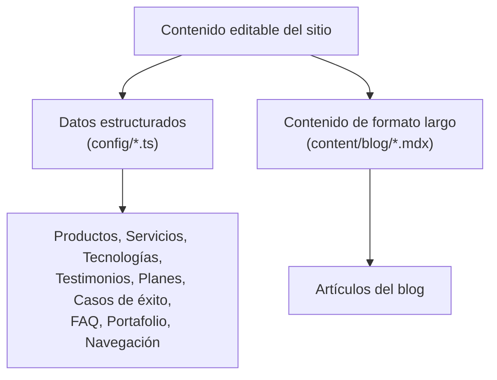

# Gestión de Contenido (CMS)

El proyecto **no usa un CMS externo** (headless o tradicional). Todo el contenido editable vive versionado dentro del propio repositorio de código, en dos formas distintas según el tipo de contenido. Este documento explica cómo administrar cada tipo de contenido **sin necesidad de escribir componentes nuevos ni tocar la lógica de presentación**.

## 1. Por qué no hay un CMS externo (contexto de la decisión)

Ver el detalle completo en [ARCHITECTURE.md](./ARCHITECTURE.md), sección 9. En resumen: el volumen de contenido es bajo, cambia con poca frecuencia, y lo gestiona el propio equipo técnico — un CMS headless (Sanity, Contentful) añadiría costo, latencia de red y una dependencia externa sin un beneficio claro en esta etapa. Esta decisión debe **revisarse** el día en que un equipo de marketing no técnico necesite publicar contenido sin pasar por un desarrollador — ver [FUTURE_IMPROVEMENTS.md](./FUTURE_IMPROVEMENTS.md).

## 2. Los dos tipos de contenido editable



## 3. Editar contenido estructurado (`config/`)

Cada archivo de `config/` es un array (o pocos objetos) de TypeScript tipado. **Editarlo es tan simple como agregar/modificar un elemento del array** — no requiere tocar ningún componente.

### 3.1. Agregar un producto nuevo

Editar `config/products.ts`:

```ts
export const products: Product[] = [
  // ...productos existentes
  {
    slug: "nuevo-producto",              // debe ser único, kebab-case
    name: "Nombre del Producto",
    tagline: "Frase corta que resume el valor del producto",
    description: "Descripción de 1–2 frases para la tarjeta y el hero del detalle.",
    image: "/images/products/placeholder-nuevo-producto.svg", // ver PERFORMANCE.md sobre imágenes reales
    status: "disponible",                // "disponible" | "beta" | "proximamente"
    category: "Categoría del producto",
    features: [
      "Característica 1",
      "Característica 2",
      "Característica 3",
    ],
    // modules es opcional — solo LogikaSoft ERP lo usa actualmente
  },
];
```

Con solo este cambio:
- Aparece automáticamente en `/productos` (listado).
- Se genera automáticamente su página `/productos/nuevo-producto` en el próximo `pnpm build` (gracias a `generateStaticParams`).
- Se agrega automáticamente a `/sitemap.xml`.
- Si se marca `featured: true`, aparecerá también en la sección de productos destacados de Home.

**No olvidar:** si el producto debe destacarse en el menú del footer, agregarlo también a `footerNav.products` en `config/site.ts`.

### 3.2. Agregar/editar módulos de LogikaSoft ERP

Dentro del mismo objeto de `logikasoft-erp` en `config/products.ts`, editar el array `modules`:

```ts
modules: [
  // ...módulos existentes
  { name: "Nuevo Módulo", status: "disponible" },       // o status: "proximamente"
],
```

### 3.3. Agregar un servicio nuevo

Editar `config/services.ts`. Requiere elegir un ícono de Lucide (ver [DESIGN_SYSTEM.md](./DESIGN_SYSTEM.md) y [TROUBLESHOOTING.md](./TROUBLESHOOTING.md) sobre verificar que el ícono exista en la versión instalada):

```ts
import { Rocket } from "lucide-react"; // verificar que exista en node_modules/lucide-react/dist/esm/icons/

export const services: Service[] = [
  // ...servicios existentes
  {
    slug: "nuevo-servicio",
    title: "Nuevo Servicio",
    description: "Descripción breve del servicio (1 frase).",
    icon: Rocket,
  },
];
```

### 3.4. Agregar una tecnología

Editar `config/technologies.ts`:

```ts
{ name: "Nombre de la tecnología", category: "Backend" }, // categorías válidas: "Backend" | "Frontend" | "Cloud & DevOps" | "Datos"
```

### 3.5. Agregar un testimonio

Editar `config/testimonials.ts`:

```ts
{
  quote: "Texto del testimonio, en primera persona.",
  author: "Nombre de la persona",
  role: "Cargo",
  company: "Empresa (o 'Cliente LOGIKA SOFT' si se prefiere anonimizar)",
},
```

### 3.6. Editar los planes de precios

Editar `config/pricing.ts`. Solo un plan debe tener `featured: true` a la vez (es el que recibe el estilo visual destacado):

```ts
{
  name: "Nombre del plan",
  description: "Para quién es este plan.",
  price: "A la medida",
  priceNote: "cotización personalizada",
  featured: false,
  features: ["Característica 1", "Característica 2"],
  cta: "Solicitar Cotización",
},
```

### 3.7. Agregar un caso de éxito

Editar `config/success-stories.ts`. También existe el array plano `clients` (solo nombres, mostrado como lista de logotipo textual):

```ts
// En successStories:
{
  slug: "nuevo-caso",
  client: "Nombre del cliente",
  industry: "Industria",
  summary: "Resumen del proyecto en 1–2 frases.",
  results: ["Resultado medible 1", "Resultado medible 2"],
  image: "/images/portfolio/placeholder-nuevo-caso.svg",
},

// En clients (si se quiere mostrar el logo/nombre en la franja de "Empresas que confían en nosotros"):
"Nombre del Cliente Nuevo",
```

### 3.8. Agregar una pregunta frecuente

Editar `config/faq.ts` — se refleja automáticamente tanto en el `Accordion` visible como en el JSON-LD `FAQPage` (ver [SEO.md](./SEO.md)):

```ts
{
  question: "¿Pregunta del usuario?",
  answer: "Respuesta completa y clara.",
},
```

### 3.9. Agregar un ítem de portafolio

Editar `config/portfolio.ts`. Si se usa una categoría nueva (no existente en los ítems actuales), se añadirá automáticamente como nuevo botón de filtro (el array `portfolioCategories` se deriva dinámicamente de `portfolioItems`, no hay que mantenerlo a mano):

```ts
{
  slug: "nuevo-proyecto",
  title: "Título del proyecto",
  category: "Categoría (nueva o existente)",
  image: "/images/portfolio/placeholder-nuevo-proyecto.svg",
  description: "Descripción breve del proyecto.",
},
```

### 3.10. Editar navegación, datos de contacto o redes sociales

Todo en `config/site.ts`:

- `siteConfig.contact` → correo, teléfono, WhatsApp, dirección (se reflejan automáticamente en Footer, `/contacto` y JSON-LD `Organization`).
- `siteConfig.socials` → URLs de LinkedIn/Facebook/Instagram/GitHub (Footer).
- `mainNav` → enlaces del menú principal (Header + menú móvil).
- `footerNav` → las 4 columnas de enlaces del Footer.

## 4. Editar/agregar artículos del blog (MDX)

Ver también el flujo paso a paso en [MAINTENANCE.md](./MAINTENANCE.md#agregar-un-artículo-de-blog).

### 4.1. Estructura obligatoria de un artículo

Archivo nuevo en `content/blog/nombre-del-articulo.mdx` (el nombre de archivo **debe** coincidir con el campo `slug` del frontmatter):

```mdx
---
title: "Título del artículo"
slug: "nombre-del-articulo"
excerpt: "Resumen de 1–2 frases, usado en la tarjeta y como meta-descripción."
date: "2026-03-01"
author: "Equipo LOGIKA SOFT"
category: "Categoría"
tags: ["Tag 1", "Tag 2"]
coverImage: "/images/blog/placeholder-nuevo.svg"
featured: false
---

Contenido del artículo en **Markdown**. Puede incluir:

## Subtítulos

- Listas
- Con viñetas

Y párrafos normales de texto.
```

### 4.2. Reglas del frontmatter

| Campo | Obligatorio | Notas |
|---|---|---|
| `title` | Sí | Se usa como `<h1>` y como `<title>` de la página (vía `generateMetadata`) |
| `slug` | Sí | Debe ser idéntico al nombre del archivo sin `.mdx` |
| `excerpt` | Sí | Usado como meta-descripción — ver buenas prácticas de longitud en [SEO.md](./SEO.md) |
| `date` | Sí | Formato `"YYYY-MM-DD"`, se usa para ordenar (más reciente primero) y en el sitemap |
| `author` | Sí | Texto libre |
| `category` | Sí | Se usa para el filtro de categorías en `/blog` — reutilizar categorías existentes cuando sea posible para no fragmentar el filtro |
| `tags` | Sí | Array de strings, se muestran al final del artículo y son buscables desde el buscador de `/blog` |
| `coverImage` | Sí | Ruta a la imagen de portada (hoy sin archivo real todavía, ver [PERFORMANCE.md](./PERFORMANCE.md)) |
| `featured` | No (default `false`) | Reservado para una futura sección de "artículo destacado" — ver [FUTURE_IMPROVEMENTS.md](./FUTURE_IMPROVEMENTS.md) |

### 4.3. Qué NO hacer al escribir un artículo

- No usar HTML crudo dentro del `.mdx` salvo que sea estrictamente necesario (Markdown cubre el 100% de los casos actuales del blog).
- No repetir el `title` como primer encabezado dentro del contenido — la página ya renderiza el título por separado, a partir del frontmatter.
- No usar un `slug` que ya exista (rompería el enrutamiento — dos archivos no pueden resolver la misma URL).

### 4.4. Publicar el artículo

A diferencia de un CMS tradicional, **publicar = hacer un despliegue**. El flujo es:

1. Crear el archivo `.mdx` en `content/blog/`.
2. Verificar localmente con `pnpm dev` (visitar `/blog` y `/blog/<slug>`).
3. Confirmar con `pnpm build` que la nueva ruta se genera correctamente (aparece en el listado `● /blog/<slug>` de la salida del build).
4. Hacer commit, abrir Pull Request, fusionar a `main` (ver Git Flow en [CODING_STANDARDS.md](./CODING_STANDARDS.md)).
5. El despliegue a producción (automático en Vercel, o manual según la plataforma — ver [DEPLOYMENT.md](./DEPLOYMENT.md)) publica el artículo.

## 5. Quién puede editar contenido hoy

Actualmente, **cualquier persona que pueda hacer un Pull Request al repositorio** puede editar contenido — no hay un panel de administración ni una interfaz visual de edición. Esto significa que, en la práctica, **solo el equipo de desarrollo** (o alguien cómodo editando archivos TypeScript/Markdown y usando Git) puede publicar cambios de contenido.

**Esto es una limitación conocida y aceptada en la v1 del proyecto.** Si el equipo de marketing de LOGIKA SOFT necesita autonomía para publicar sin pasar por un desarrollador, la solución recomendada es evaluar un CMS headless (Sanity o Contentful, ya considerados originalmente) — ver el detalle de esta iniciativa priorizada en [FUTURE_IMPROVEMENTS.md](./FUTURE_IMPROVEMENTS.md).

## 6. Validación de contenido nuevo

No hay validación automatizada de la forma del contenido de `config/` más allá del **chequeo de tipos de TypeScript** en tiempo de compilación (`pnpm build` fallará si, por ejemplo, se omite un campo obligatorio de `Product` o se usa un valor de `status` fuera de `"disponible" | "beta" | "proximamente"`). Esto ya es una capa de seguridad razonable: **un contenido mal formado nunca llega a producción**, porque el build fallaría antes del despliegue.
