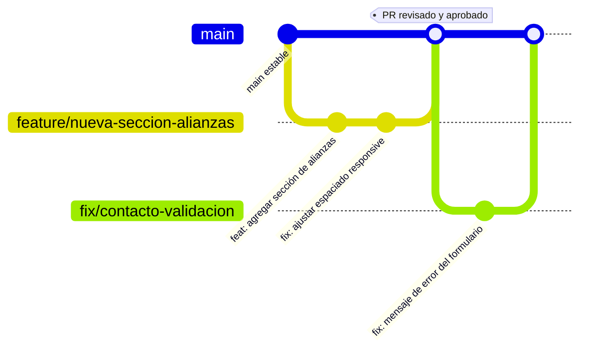

# Estándares de Código

Este documento define las convenciones obligatorias del proyecto. Su cumplimiento se verifica parcialmente con ESLint/TypeScript (`pnpm lint`, `pnpm build`) y parcialmente mediante revisión de código humana (Pull Requests).

## 1. Convenciones de nombres de archivos

| Tipo de archivo | Convención | Ejemplo |
|---|---|---|
| Componente de React | `kebab-case.tsx` | `product-card.tsx`, `contact-form.tsx` |
| Página / layout (convención Next.js) | `page.tsx` / `layout.tsx` (fijo, no cambiar) | `app/(marketing)/empresa/page.tsx` |
| Server Action | `kebab-case.ts`, verbo descriptivo dentro | `app/actions/contact.ts` |
| Archivo de datos/config | `kebab-case.ts`, plural cuando exporta una lista | `services.ts`, `products.ts` |
| Hook personalizado | `use-kebab-case.ts` | `use-media-query.ts` (futuro) |
| Tipos | `kebab-case.ts` o `index.ts` si es el único archivo del dominio | `types/index.ts` |
| Artículo de blog | `kebab-case.mdx`, igual al `slug` del frontmatter | `senales-tu-empresa-necesita-un-erp.mdx` |
| Documentación | `SCREAMING_SNAKE_CASE.md` (estándar de este repositorio en `/docs`) | `ARCHITECTURE.md` |

## 2. Convenciones de nombres de identificadores en código

| Elemento | Convención | Ejemplo |
|---|---|---|
| Componente de React | `PascalCase`, coincide con el nombre del archivo | `export function ProductCard(...)` en `product-card.tsx` |
| Hook | `camelCase`, prefijo `use` | `useTheme()`, `useInView()` |
| Función utilitaria | `camelCase`, verbo + sustantivo | `buildMetadata()`, `getProductBySlug()` |
| Constante / dato exportado | `camelCase` para arrays/objetos de configuración; `SCREAMING_SNAKE_CASE` solo para constantes verdaderamente inmutables de bajo nivel | `export const services: Service[]`, `const BLOG_DIR = path.join(...)` |
| Tipo / Interfaz | `PascalCase`, sustantivo singular | `type Product`, `type BlogFrontmatter` |
| Prop de componente | `camelCase` | `showCta`, `tone`, `align` |
| Variantes de `cva` | `camelCase` en la clave, `camelCase` o palabra descriptiva en el valor | `variant: "primary" | "secondary" | "outline"` |
| Server Action | `camelCase`, verbo en infinitivo + sustantivo | `submitContactForm()` |

**No usar:** prefijos de tipo Hungarian notation (`strName`, `bIsActive`), ni abreviaturas ambiguas (`prod` por `product` está permitido solo en nombres de archivo muy locales, pero no en identificadores exportados).

## 3. Tipos e interfaces

- Usar `type` para la mayoría de los contratos de datos del proyecto (es la convención ya establecida en `types/index.ts`); reservar `interface` únicamente si se necesita *declaration merging* (no hay casos actuales en el proyecto).
- Preferir tipos derivados de Zod (`z.infer<typeof schema>`) en lugar de duplicar manualmente un `type` y un esquema de validación para la misma entidad — ver `features/contact/schema.ts`.
- Los tipos de dominio compartidos (`Product`, `Service`, `BlogPost`, etc.) viven en `types/index.ts` y se importan con el alias `@/types`.
- Evitar `any`. Si el tipo es genuinamente desconocido, usar `unknown` y angostarlo (*type narrowing*) antes de operar sobre el valor.

```ts
// ✅ Correcto
export type ProductStatus = "disponible" | "beta" | "proximamente";

export type Product = {
  slug: string;
  name: string;
  status: ProductStatus;
  // ...
};

// ❌ Evitar
export type Product = {
  slug: any;
  data: any;
};
```

## 4. Componentes de React

- **Un componente por archivo.** Si un archivo necesita un sub-componente auxiliar de uso exclusivamente local (ej. `FooterColumn` dentro de `footer.tsx`), es aceptable definirlo en el mismo archivo sin exportarlo.
- **Named exports**, no `export default`, salvo en archivos de convención de Next.js (`page.tsx`, `layout.tsx`) donde Next.js lo exige.
- **Props tipadas explícitamente** con `type`, nunca con `any` ni con inferencia implícita en componentes exportados.
- Declarar `"use client"` **solo** cuando el componente lo requiera (ver criterio completo en [ARCHITECTURE.md](./ARCHITECTURE.md), sección 3). Si al revisar un Pull Request un componente tiene `"use client"` pero no usa hooks de estado, efectos, eventos ni hooks de librerías de navegador, debe cuestionarse y probablemente removerse.
- Usar la función `cn()` (`@/utils/cn`) para componer clases de Tailwind condicionalmente — nunca concatenar strings de clases manualmente con template literals cuando haya lógica condicional involucrada.

```tsx
// ✅ Correcto
export function Badge({ className, tone, ...props }: ComponentProps<"span"> & VariantProps<typeof badgeVariants>) {
  return <span className={cn(badgeVariants({ tone }), className)} {...props} />;
}

// ❌ Evitar
export default function badge(props) {
  return <span className={"badge " + (props.tone ? props.tone : "")} {...props} />;
}
```

## 5. Server Actions

- Deben empezar con la directiva `"use server"` en la primera línea del archivo.
- Deben **validar su entrada con Zod** (`schema.safeParse`), incluso si el cliente ya validó — es la única barrera real de seguridad (ver [SECURITY.md](./SECURITY.md)).
- Deben retornar un objeto tipado y predecible (nunca lanzar una excepción no controlada hacia el cliente); usar `try/catch` alrededor de cualquier llamada a un servicio externo.
- No deben acceder directamente a `process.env` de secretos fuera de la capa de `services/` — delegar esa responsabilidad a un cliente en `services/` (ver `getResendClient()`).

## 6. Servicios (`services/`)

- Exponer funciones "factoría" (`getXClient()`) en lugar de instanciar el SDK a nivel de módulo con una clave que podría no existir en build time.
- Nunca importar un archivo de `services/` desde un Client Component.

## 7. Datos de configuración (`config/`)

- Cada archivo exporta arrays u objetos **tipados** usando los tipos de `types/index.ts`.
- Los `slug` deben ser únicos dentro de su colección, en `kebab-case`, y deben coincidir exactamente con el segmento de URL usado en la ruta dinámica correspondiente.
- No incluir lógica de presentación (JSX, clases de Tailwind) dentro de `config/` — solo datos.

## 8. Estilos con Tailwind

- Preferir utilidades de Tailwind sobre CSS personalizado. Solo agregar CSS a `app/globals.css` para: tokens de diseño (`@theme`), animaciones con `@keyframes`, o ajustes globales imposibles de expresar con utilidades (`::selection`, `:focus-visible`).
- No introducir una nueva escala de color fuera de los tokens `brand-*` ya definidos sin actualizar [DESIGN_SYSTEM.md](./DESIGN_SYSTEM.md).
- Ordenar las clases de forma legible: primero layout (`flex`, `grid`), luego espaciado (`gap-4`, `p-6`), luego tipografía, luego color, luego estados (`hover:`, `dark:`, `focus-visible:`). No es una regla forzada por una herramienta todavía, pero se sigue por consistencia — considerar agregar `prettier-plugin-tailwindcss` (ver [MAINTENANCE.md](./MAINTENANCE.md)).

## 9. Linting y formateo

```bash
pnpm lint
```

El proyecto debe mantenerse **siempre en cero errores y cero warnings** de ESLint. Reglas activas relevantes (`eslint.config.mjs`, basado en `eslint-config-next`):

- `eslint-config-next/core-web-vitals` — reglas de rendimiento y accesibilidad específicas de Next.js.
- `eslint-config-next/typescript` — reglas de TypeScript (incluye `@typescript-eslint/no-unused-vars`).
- `react-hooks/*` — incluye la regla `react-hooks/set-state-in-effect`, que detecta antipatrones como llamar a `setState` de forma síncrona dentro de un `useEffect` (ver el caso real corregido en `components/layout/theme-toggle.tsx`, documentado en [TROUBLESHOOTING.md](./TROUBLESHOOTING.md)).

> El proyecto no usa Prettier todavía como paso de CI obligatorio; el formateo actual es manual/consistente por convención de editor. Ver la recomendación de incorporarlo en [MAINTENANCE.md](./MAINTENANCE.md).

## 10. Convenciones de Git y mensajes de commit

Se sigue el estilo de **Conventional Commits**:

```
<tipo>(<alcance opcional>): <descripción en minúscula, modo imperativo>

[cuerpo opcional explicando el porqué, no el qué]
```

| Tipo | Cuándo usarlo |
|---|---|
| `feat` | Nueva funcionalidad visible para el usuario (una página, un componente, una sección) |
| `fix` | Corrección de un defecto |
| `docs` | Cambios exclusivos de documentación (`/docs`, comentarios) |
| `style` | Cambios que no afectan la lógica (formateo, espacios) |
| `refactor` | Reestructuración de código sin cambiar comportamiento observable |
| `perf` | Cambio enfocado explícitamente en rendimiento |
| `test` | Agregar o modificar pruebas |
| `chore` | Tareas de mantenimiento (dependencias, configuración) |

Ejemplos reales aplicables a este proyecto:

```
feat(productos): agregar página de detalle dinámica con módulos del ERP
fix(contacto): corregir validación de teléfono opcional en el esquema de Zod
docs(architecture): documentar el flujo de la Server Action de contacto
chore(deps): actualizar next-themes a 0.5.x
```

## 11. Git Flow

El proyecto usa un flujo simplificado basado en **trunk-based development** con rama principal protegida:



**Reglas:**

1. `main` siempre debe estar en un estado desplegable (`pnpm build` y `pnpm lint` pasan sin errores).
2. Todo cambio se desarrolla en una rama descriptiva: `feature/<nombre>`, `fix/<nombre>`, `docs/<nombre>`, `chore/<nombre>`.
3. Los cambios llegan a `main` mediante **Pull Request**, no mediante push directo.
4. Antes de abrir el PR: correr `pnpm lint` y `pnpm build` localmente.
5. El PR debe describir *qué* cambia y *por qué* (no solo repetir el diff).
6. Tras fusionar una funcionalidad significativa, registrar la entrada correspondiente en [CHANGELOG.md](./CHANGELOG.md).
7. Nunca hacer `git push --force` sobre `main`.

## 12. Revisión de código (checklist mínimo de un PR)

- [ ] `pnpm lint` sin errores/warnings.
- [ ] `pnpm build` compila sin errores de tipos.
- [ ] Ningún componente nuevo usa `"use client"` sin necesitarlo realmente.
- [ ] Ningún secreto ni valor de `.env.local` fue commiteado.
- [ ] Las nuevas rutas exportan `metadata` o `generateMetadata` (ver [SEO.md](./SEO.md)).
- [ ] El contenido nuevo (producto, servicio, artículo) sigue el tipado de `types/index.ts`.
- [ ] Se probó manualmente en el navegador (ver checklist de [TESTING.md](./TESTING.md)).
