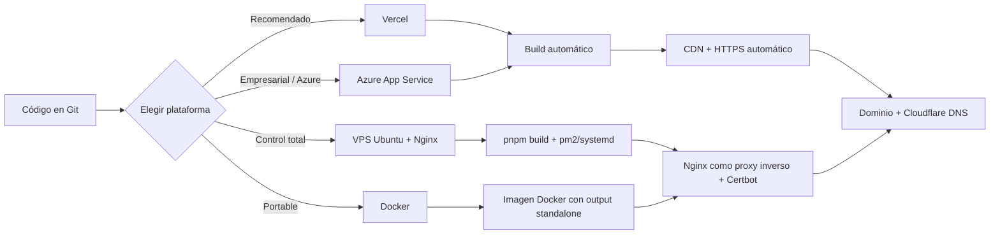

# Guía de Despliegue

Este documento describe cómo desplegar el sitio de **LOGIKA SOFT** en distintos entornos de producción: Vercel, Azure App Service, un VPS Ubuntu con Nginx, Docker, y cómo configurar Cloudflare, HTTPS y el dominio.

## Consideración arquitectónica previa

El proyecto **no es un sitio 100% estático**. Aunque la mayoría de las páginas se pre-renderizan como HTML estático en build time (`○ Static` en la salida de `pnpm build`), el formulario de `/contacto` depende de una **Server Action** (`app/actions/contact.ts`) que se ejecuta en tiempo de petición dentro de un runtime de Node.js.

**Implicación práctica:** el sitio **no puede desplegarse con `next export` (exportación estática pura)** ni servirse desde un bucket de almacenamiento estático (S3, GitHub Pages, etc.) sin perder el formulario de contacto. Debe desplegarse en un entorno que ejecute Node.js: Vercel, un servidor Node tradicional, un contenedor Docker, o un servicio de App Service con soporte Node.js.



---

## 1. Despliegue en Vercel (recomendado)

Vercel es la plataforma creada por el mismo equipo de Next.js y ofrece soporte de primera clase para Server Actions, ISR, Edge Middleware y optimización de imágenes sin configuración adicional.

### 1.1. Pasos

1. Subir el repositorio a GitHub, GitLab o Bitbucket.
2. En [vercel.com](https://vercel.com), seleccionar **Add New → Project** e importar el repositorio.
3. Vercel detecta automáticamente que es un proyecto Next.js. Configuración recomendada:
   - **Framework Preset:** Next.js
   - **Build Command:** `pnpm build` (detectado automáticamente por la presencia de `pnpm-lock.yaml`)
   - **Output Directory:** (dejar en blanco; Next.js lo gestiona internamente)
   - **Install Command:** `pnpm install`
4. En **Environment Variables**, agregar:
   | Key | Value | Environment |
   |---|---|---|
   | `RESEND_API_KEY` | `re_xxxxxxxxxxxx` | Production, Preview |
5. Hacer clic en **Deploy**.

### 1.2. Dominio personalizado en Vercel

1. En el proyecto desplegado, ir a **Settings → Domains**.
2. Agregar `www.logikasoft.com` y `logikasoft.com`.
3. Vercel proporciona los registros DNS necesarios (`A`/`CNAME`). Configurarlos en el proveedor de DNS (o en Cloudflare, ver sección 5).
4. Vercel emite y renueva automáticamente el certificado TLS (HTTPS) mediante Let's Encrypt — no requiere configuración manual.

### 1.3. Despliegues automáticos

Cada `git push` a la rama principal genera un despliegue de producción; cada Pull Request genera un despliegue de *preview* con una URL única, ideal para revisar cambios antes de fusionarlos.

---

## 2. Despliegue en Azure App Service

Azure App Service es una opción natural si el resto de la infraestructura de LOGIKA SOFT (o de sus clientes de ERP) ya vive en Azure, dado que el stack de LogikaSoft ERP usa .NET/Azure (ver [TECHNOLOGIES.md](./TECHNOLOGIES.md)).

### 2.1. Requisitos

- Suscripción de Azure.
- Azure CLI instalada (`az`) o el portal web de Azure.
- App Service Plan con **stack de Node.js 20 LTS** (Linux).

### 2.2. Pasos vía Azure CLI

```bash
# 1. Iniciar sesión
az login

# 2. Crear grupo de recursos (si no existe)
az group create --name rg-logikasoft --location eastus

# 3. Crear App Service Plan (Linux, tier B1 o superior)
az appservice plan create \
  --name plan-logikasoft \
  --resource-group rg-logikasoft \
  --is-linux \
  --sku B1

# 4. Crear la Web App con runtime Node 20
az webapp create \
  --resource-group rg-logikasoft \
  --plan plan-logikasoft \
  --name logikasoft-web \
  --runtime "NODE:20-lts"

# 5. Configurar el comando de arranque
az webapp config set \
  --resource-group rg-logikasoft \
  --name logikasoft-web \
  --startup-file "pnpm start"

# 6. Configurar variables de entorno
az webapp config appsettings set \
  --resource-group rg-logikasoft \
  --name logikasoft-web \
  --settings RESEND_API_KEY="re_xxxxxxxxxxxx" \
             WEBSITE_NODE_DEFAULT_VERSION="~20" \
             SCM_DO_BUILD_DURING_DEPLOYMENT="true"

# 7. Desplegar desde Git local
az webapp deployment source config-local-git \
  --resource-group rg-logikasoft \
  --name logikasoft-web

git remote add azure <url-devuelta-por-el-comando-anterior>
git push azure main
```

> Azure App Service ejecuta `npm install` (o `pnpm install` si detecta `pnpm-lock.yaml` y `packageManager` en `package.json`) y luego el `startup-file` configurado. Verificar en los logs de despliegue (**Deployment Center → Logs**) que efectivamente use `pnpm`.

### 2.3. Dominio y HTTPS en Azure

1. **Settings → Custom domains** → agregar `www.logikasoft.com`.
2. Validar la propiedad del dominio con el registro TXT/CNAME que Azure indica.
3. **Settings → TLS/SSL settings** → activar **"Enforce HTTPS only"** y vincular un **App Service Managed Certificate** (gratuito) o subir un certificado propio.

---

## 3. Despliegue en un VPS Ubuntu (control total)

Opción recomendada cuando se requiere control total del servidor, cumplimiento normativo específico, o cuando el sitio va a alojarse junto a otros servicios propios de LOGIKA SOFT.

### 3.1. Preparar el servidor

```bash
# Actualizar el sistema
sudo apt update && sudo apt upgrade -y

# Instalar Node.js 20 LTS (vía NodeSource)
curl -fsSL https://deb.nodesource.com/setup_20.x | sudo -E bash -
sudo apt-get install -y nodejs

# Instalar pnpm
sudo npm install -g pnpm

# Instalar PM2 (gestor de procesos de Node en producción)
sudo npm install -g pm2

# Instalar Nginx
sudo apt install -y nginx

# Instalar Certbot (HTTPS gratuito con Let's Encrypt)
sudo apt install -y certbot python3-certbot-nginx
```

### 3.2. Clonar y construir el proyecto

```bash
cd /var/www
sudo git clone <url-del-repositorio> logikasoft
cd logikasoft

# Variables de entorno de producción
sudo nano .env.local
# Agregar: RESEND_API_KEY=re_xxxxxxxxxxxx

pnpm install --frozen-lockfile
pnpm build
```

### 3.3. Ejecutar con PM2

```bash
pm2 start "pnpm start" --name logikasoft
pm2 save
pm2 startup   # genera e instala el script de arranque en el sistema (systemd)
```

Comandos de operación habituales:

```bash
pm2 status                # ver estado del proceso
pm2 logs logikasoft       # ver logs en vivo
pm2 restart logikasoft    # reiniciar tras un nuevo despliegue
```

### 3.4. Configurar Nginx como proxy inverso

Crear `/etc/nginx/sites-available/logikasoft`:

```nginx
server {
    listen 80;
    server_name logikasoft.com www.logikasoft.com;

    location / {
        proxy_pass http://127.0.0.1:3000;
        proxy_http_version 1.1;
        proxy_set_header Upgrade $http_upgrade;
        proxy_set_header Connection 'upgrade';
        proxy_set_header Host $host;
        proxy_set_header X-Real-IP $remote_addr;
        proxy_set_header X-Forwarded-For $proxy_add_x_forwarded_for;
        proxy_set_header X-Forwarded-Proto $scheme;
        proxy_cache_bypass $http_upgrade;
    }
}
```

Activar el sitio:

```bash
sudo ln -s /etc/nginx/sites-available/logikasoft /etc/nginx/sites-enabled/
sudo nginx -t
sudo systemctl reload nginx
```

### 3.5. Habilitar HTTPS con Certbot

```bash
sudo certbot --nginx -d logikasoft.com -d www.logikasoft.com
```

Certbot modifica automáticamente el bloque de Nginx para redirigir HTTP → HTTPS y configura la renovación automática del certificado (`certbot renew` vía cron/systemd timer, ya instalado por el paquete).

### 3.6. Actualizar el sitio (despliegues posteriores)

```bash
cd /var/www/logikasoft
git pull origin main
pnpm install --frozen-lockfile
pnpm build
pm2 restart logikasoft
```

> Para automatizar este proceso, considerar un pipeline de CI/CD (GitHub Actions) que se conecte por SSH y ejecute estos comandos, o migrar a Docker (ver sección 4) para despliegues inmutables.

---

## 4. Despliegue con Docker

Para lograr una imagen de Docker mínima, Next.js debe configurarse con `output: "standalone"`.

### 4.1. Ajuste requerido en `next.config.ts`

```ts
import type { NextConfig } from "next";

const nextConfig: NextConfig = {
  output: "standalone",
};

export default nextConfig;
```

> **Nota:** el proyecto actualmente no define `output: "standalone"` (ver `next.config.ts` en la raíz). Añadir esta línea es un prerrequisito antes de construir la imagen Docker descrita abajo — de lo contrario, la carpeta `.next/standalone` no se genera y el `Dockerfile` fallará en el paso de copia.

### 4.2. `Dockerfile` recomendado (multi-stage build)

```dockerfile
# ---- Etapa 1: dependencias ----
FROM node:20-alpine AS deps
WORKDIR /app
RUN corepack enable && corepack prepare pnpm@11.20.0 --activate
COPY package.json pnpm-lock.yaml ./
RUN pnpm install --frozen-lockfile

# ---- Etapa 2: build ----
FROM node:20-alpine AS builder
WORKDIR /app
RUN corepack enable && corepack prepare pnpm@11.20.0 --activate
COPY --from=deps /app/node_modules ./node_modules
COPY . .
RUN pnpm build

# ---- Etapa 3: runtime ----
FROM node:20-alpine AS runner
WORKDIR /app
ENV NODE_ENV=production
COPY --from=builder /app/public ./public
COPY --from=builder /app/.next/standalone ./
COPY --from=builder /app/.next/static ./.next/static

EXPOSE 3000
ENV PORT=3000
CMD ["node", "server.js"]
```

### 4.3. `.dockerignore`

```
node_modules
.next
.git
docs
*.md
.env*
```

### 4.4. Construir y ejecutar

```bash
docker build -t logikasoft-web .
docker run -d \
  -p 3000:3000 \
  -e RESEND_API_KEY="re_xxxxxxxxxxxx" \
  --name logikasoft \
  logikasoft-web
```

### 4.5. `docker-compose.yml` (opcional, junto a Nginx)

```yaml
services:
  web:
    build: .
    restart: always
    environment:
      - RESEND_API_KEY=${RESEND_API_KEY}
    expose:
      - "3000"

  nginx:
    image: nginx:alpine
    restart: always
    ports:
      - "80:80"
      - "443:443"
    volumes:
      - ./nginx.conf:/etc/nginx/conf.d/default.conf:ro
      - ./certbot/conf:/etc/letsencrypt:ro
    depends_on:
      - web
```

---

## 5. Configuración de Cloudflare

Cloudflare se recomienda como capa de DNS, CDN y protección (WAF/DDoS) frente a cualquiera de las opciones anteriores.

1. Agregar el dominio `logikasoft.com` en el panel de Cloudflare.
2. Actualizar los *nameservers* del dominio en el registrador (GoDaddy, Namecheap, etc.) por los que indique Cloudflare.
3. Crear los registros DNS:
   | Tipo | Nombre | Valor | Proxy |
   |---|---|---|---|
   | `A` o `CNAME` | `@` | IP del VPS o `cname.vercel-dns.com` | Proxied (nube naranja) |
   | `CNAME` | `www` | `logikasoft.com` | Proxied |
4. **SSL/TLS → Overview**: modo **Full (strict)** si el origen (VPS/Azure) ya tiene su propio certificado válido; **Flexible** solo como último recurso temporal (no recomendado en producción).
5. **SSL/TLS → Edge Certificates**: activar **Always Use HTTPS** y **Automatic HTTPS Rewrites**.
6. **Speed → Optimization**: activar Brotli y Auto Minify (JS/CSS/HTML) — complementa, no sustituye, las optimizaciones nativas de Next.js.

> Si el sitio está en **Vercel**, Cloudflare debe configurarse en modo **DNS only (nube gris)** para el registro que apunta a Vercel, o usar **Full (strict)**, nunca **Flexible**, para evitar bucles de redirección HTTP↔HTTPS entre Cloudflare y Vercel (ambos ya emiten HTTPS por su cuenta).

---

## 6. HTTPS — resumen por plataforma

| Plataforma | Emisión de certificado | Renovación |
|---|---|---|
| Vercel | Automática (Let's Encrypt) | Automática |
| Azure App Service | Managed Certificate gratuito o certificado propio | Automática (Managed) / Manual (propio) |
| VPS + Nginx | Certbot (Let's Encrypt) | Automática vía systemd timer / cron |
| Docker + Nginx | Certbot en contenedor separado o certificado montado como volumen | Según configuración del contenedor de Certbot |
| Cloudflare (delante de cualquiera) | Certificado Edge de Cloudflare | Automática |

**Regla no negociable:** el sitio debe forzar HTTPS en todo momento. Ningún entorno de producción debe servir el sitio por HTTP sin redirección.

---

## 7. Variables de entorno en producción

Ver el detalle completo en [ENVIRONMENT_VARIABLES.md](./ENVIRONMENT_VARIABLES.md). Resumen de la única variable requerida actualmente:

| Variable | Requerida en producción | Dónde configurarla |
|---|---|---|
| `RESEND_API_KEY` | Sí (si se quiere que el formulario de contacto envíe correos reales) | Panel de variables de entorno de la plataforma elegida (nunca en el repositorio) |

> **Nunca** commitear `.env.local` ni ningún archivo `.env*` con valores reales al repositorio. El `.gitignore` del proyecto ya excluye `.env*` por defecto.

---

## 8. Checklist previo a cada despliegue a producción

- [ ] `pnpm lint` sin errores ni warnings.
- [ ] `pnpm build` completa sin errores de tipos ni de compilación.
- [ ] Variables de entorno de producción configuradas en la plataforma (`RESEND_API_KEY`).
- [ ] `siteConfig.url` en `config/site.ts` apunta al dominio real de producción (usado por `metadataBase`, `sitemap.ts` y JSON-LD).
- [ ] Dominio y HTTPS verificados.
- [ ] `sitemap.xml` y `robots.txt` accesibles públicamente tras el despliegue.
- [ ] Formulario de `/contacto` probado end-to-end en el entorno de producción (envío real de correo).
