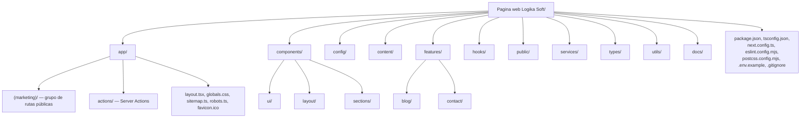

# Estructura de Carpetas

Este documento explica, carpeta por carpeta y archivo relevante por archivo, el propósito de cada parte del repositorio. Úsalo como referencia cuando no sepas dónde debe vivir un archivo nuevo.

## Árbol completo del proyecto



---

## 1. `/app` — Rutas, layouts y Server Actions

Carpeta reservada por convención del **App Router de Next.js**. Todo lo que esté aquí participa directamente en el enrutamiento del sitio.

```
app/
├── (marketing)/                  ← grupo de rutas (no afecta la URL)
│   ├── layout.tsx                ← Header + <main> + Footer, envuelve todas las páginas públicas
│   ├── page.tsx                  ← Home ("/")
│   ├── empresa/page.tsx          ← "/empresa"
│   ├── servicios/page.tsx        ← "/servicios"
│   ├── productos/
│   │   ├── page.tsx              ← "/productos" (listado)
│   │   └── [slug]/page.tsx       ← "/productos/:slug" (detalle dinámico)
│   ├── tecnologias/page.tsx      ← "/tecnologias"
│   ├── casos-de-exito/page.tsx   ← "/casos-de-exito"
│   ├── portafolio/page.tsx       ← "/portafolio"
│   ├── planes/page.tsx           ← "/planes"
│   ├── blog/
│   │   ├── page.tsx              ← "/blog" (listado)
│   │   └── [slug]/page.tsx       ← "/blog/:slug" (artículo)
│   ├── faq/page.tsx              ← "/faq"
│   └── contacto/page.tsx         ← "/contacto"
├── actions/
│   └── contact.ts                ← Server Action: submitContactForm()
├── layout.tsx                    ← Layout raíz: <html>, <body>, fuente, ThemeProvider, JSON-LD Organization
├── globals.css                   ← Tokens de diseño (CSS variables) + configuración de Tailwind v4
├── sitemap.ts                    ← Genera /sitemap.xml dinámicamente
├── robots.ts                     ← Genera /robots.txt dinámicamente
└── favicon.ico
```

**Qué va aquí:** únicamente archivos que Next.js reconoce por convención (`page.tsx`, `layout.tsx`, `route.ts`, `sitemap.ts`, `robots.ts`, `loading.tsx`, `error.tsx`, `not-found.tsx`) y las Server Actions (`app/actions/*.ts`).

**Qué NO va aquí:** componentes de presentación reutilizables (van en `components/`), lógica de negocio reutilizable fuera de una Server Action (va en `features/`), datos de contenido (van en `config/`).

**Buenas prácticas:**
- Cada `page.tsx` debe exportar su propio `metadata` (estático) o `generateMetadata` (dinámico) — ver [SEO.md](./SEO.md).
- Las páginas deben mantenerse como **Server Components**; si necesitan una parte interactiva, deben importar un Client Component de `components/`, nunca convertirse ellas mismas en `"use client"` (ver [ARCHITECTURE.md](./ARCHITECTURE.md), sección 3).
- Nuevas rutas públicas siempre deben crearse dentro de `app/(marketing)/`, no directamente en `app/`, salvo que se trate de un archivo de convención de nivel raíz (`sitemap.ts`, `robots.ts`).

---

## 2. `/components` — Componentes de React

Dividida en tres subcarpetas con responsabilidades estrictamente distintas:

### 2.1. `components/ui/` — Primitivos de diseño

Componentes **genéricos, sin conocimiento del dominio de negocio**. No importan de `config/` ni de `types/index.ts` (salvo tipos puramente estructurales). Ejemplos: `button.tsx`, `card.tsx`, `badge.tsx`, `container.tsx`, `section.tsx`, `field.tsx`, `accordion.tsx`, `animated-counter.tsx`, `fade-in.tsx`, `glass-panel.tsx`, `social-icons.tsx`.

> **Regla:** si un componente de `ui/` necesitara importar algo de `config/products.ts`, es una señal de que está mal ubicado — pertenece a `components/sections/`.

### 2.2. `components/layout/` — Estructura de página compartida

Componentes que conforman el "andamiaje" visual del sitio, usados por el layout de `(marketing)`: `header.tsx`, `footer.tsx`, `logo.tsx`, `mobile-nav.tsx`, `theme-toggle.tsx`, `theme-provider.tsx`.

### 2.3. `components/sections/` — Bloques de página con conocimiento del negocio

Componentes más grandes que representan una sección completa de una página (un hero, una grilla de servicios, una tabla de precios) y que sí pueden leer datos de `config/` por defecto. Ejemplos: `hero.tsx`, `services-grid.tsx`, `products-showcase.tsx`, `product-card.tsx`, `product-visual.tsx`, `tech-stack.tsx`, `success-stories.tsx`, `testimonials.tsx`, `pricing-table.tsx`, `cta-banner.tsx`, `blog-card.tsx`, `blog-list.tsx`, `portfolio-grid.tsx`, `company-overview.tsx`.

**Buenas prácticas:**
- Un componente por archivo, nombre de archivo en `kebab-case`, coincidiendo con el nombre exportado en `PascalCase` (`product-card.tsx` → `export function ProductCard`).
- Preferir *named exports* sobre *default exports* (excepto en archivos de convención de Next.js).
- Toda sección debe aceptar sus datos como props cuando sea razonable (aunque tenga un valor por defecto desde `config/`), para permitir reutilización entre Home y la página dedicada (patrón ya usado en `ServicesGrid`, `ProductsShowcase`).

---

## 3. `/config` — Contenido y catálogos del sitio

**El corazón editable del sitio.** Cada archivo exporta datos tipados (usando los tipos de `types/index.ts`) que alimentan las secciones y páginas.

| Archivo | Contenido |
|---|---|
| `site.ts` | Metadatos globales (`siteConfig`): nombre, URL, descripción, contacto, redes sociales; y la navegación (`mainNav`, `footerNav`). |
| `products.ts` | Catálogo de los 8 productos, incluyendo los módulos de LogikaSoft ERP. |
| `services.ts` | Los 12 servicios de la empresa, con su ícono de Lucide. |
| `technologies.ts` | Stack tecnológico mostrado en `/tecnologias`. |
| `testimonials.ts` | Testimonios de clientes. |
| `pricing.ts` | Los 3 planes mostrados en `/planes`. |
| `success-stories.ts` | Casos de éxito y lista de clientes. |
| `faq.ts` | Preguntas frecuentes (también usadas para el JSON-LD `FAQPage`). |
| `portfolio.ts` | Ítems del portafolio y sus categorías de filtro. |

Ver cómo modificar este contenido en [CMS.md](./CMS.md) y [MAINTENANCE.md](./MAINTENANCE.md).

**Qué NO va aquí:** lógica (funciones que hacen fetch, transforman datos complejos o acceden al sistema de archivos) — eso pertenece a `features/`.

---

## 4. `/content` — Contenido en formato de archivo (MDX)

```
content/
└── blog/
    ├── senales-tu-empresa-necesita-un-erp.mdx
    ├── facturacion-electronica-guia-rapida.mdx
    └── software-a-la-medida-vs-software-generico.mdx
```

Cada archivo `.mdx` tiene un bloque de *frontmatter* (YAML) con metadatos (`title`, `slug`, `excerpt`, `date`, `author`, `category`, `tags`, `coverImage`, `featured`) seguido del contenido en Markdown/MDX. El **nombre del archivo debe coincidir exactamente con el campo `slug`** del frontmatter (convención usada por `features/blog/mdx.ts` para resolver `/blog/[slug]`).

---

## 5. `/features` — Lógica de dominio reutilizable

Código que **no es un componente de UI** pero tampoco es infraestructura pura: es lógica de negocio/dominio.

```
features/
├── blog/
│   └── mdx.ts        ← getAllPostsMeta(), getPostRawBySlug(), getAllCategories(), getAllTags()
└── contact/
    └── schema.ts     ← contactFormSchema (Zod), tipos ContactFormValues / ContactFormResult
```

**Cuándo crear una nueva carpeta en `features/`:** cuando se agregue un dominio nuevo con lógica propia no trivial (por ejemplo, si en el futuro se agrega `features/portfolio/` con lógica de filtrado más compleja que la actual, o `features/newsletter/` para una futura suscripción a novedades).

---

## 6. `/hooks` — Hooks de React reutilizables

Actualmente **vacía** (reservada). Cuando se necesite extraer lógica de estado repetida entre varios Client Components (por ejemplo, `useMediaQuery`, `useScrollDirection`, `useDebouncedValue`), debe crearse aquí como `use-nombre-del-hook.ts`, exportando una función `useNombreDelHook`.

> No confundir con los *hooks* propios de Next.js/React (`useState`, `useRouter`, etc.), que se importan directamente de sus paquetes y no requieren un archivo en esta carpeta.

---

## 7. `/public` — Activos estáticos

Servida directamente en la raíz del dominio (`public/logo.svg` → `https://logikasoft.com/logo.svg`). Actualmente **vacía**: el sitio no usa todavía imágenes rasterizadas reales; los "espacios de imagen" de productos, portafolio y blog se representan con el componente `ProductVisual` (un degradado de marca), a la espera de activos reales (ver [FUTURE_IMPROVEMENTS.md](./FUTURE_IMPROVEMENTS.md) y las notas de `image` en `types/index.ts`).

**Convención sugerida cuando se agreguen imágenes reales:**

```
public/
├── images/
│   ├── products/       ← imágenes de config/products.ts (campo `image`)
│   ├── portfolio/       ← imágenes de config/portfolio.ts
│   ├── blog/            ← imágenes de content/blog (campo `coverImage`)
│   └── logos/           ← logo real de la marca (SVG/PNG) cuando se reciba el manual de identidad
└── og-default.jpg       ← imagen de Open Graph por defecto (referenciada en config/site.ts → ogImage)
```

---

## 8. `/services` — Clientes de servicios externos

```
services/
└── resend.ts    ← getResendClient(): instancia el SDK de Resend solo si RESEND_API_KEY existe
```

**Qué va aquí:** cualquier cliente/SDK de un servicio de terceros (correo, pagos, analítica, un futuro CMS headless). **Nunca** debe llamarse directamente desde un Client Component — solo desde Server Actions o Server Components (ver [SECURITY.md](./SECURITY.md), ya que estos módulos suelen usar variables de entorno sensibles).

---

## 9. `/types` — Contratos de datos de TypeScript

```
types/
└── index.ts   ← Service, Product, ProductModule, ProductStatus, TechItem,
                  SuccessStory, Testimonial, PricingPlan, FaqItem,
                  PortfolioItem, BlogFrontmatter, BlogPost
```

Único archivo actualmente, dado el tamaño del proyecto. Si el archivo crece mucho, dividir por dominio (`types/product.ts`, `types/blog.ts`, etc.) y re-exportar desde `types/index.ts` para no romper los imports existentes (`import type { Product } from "@/types"`).

---

## 10. `/utils` — Funciones puras y transversales

```
utils/
├── cn.ts    ← cn(): combina clsx + tailwind-merge para componer clases de Tailwind sin colisiones
└── seo.ts   ← buildMetadata(): genera el objeto Metadata de Next.js de forma consistente
```

**Qué va aquí:** funciones puras, sin estado, sin efectos secundarios, que no dependen de React ni de Next.js más allá de tipos. Si una función necesita `"use client"` o hooks de React, no pertenece a `utils/`.

---

## 11. `/docs` — Documentación del proyecto

Esta misma carpeta. Ver el índice completo en [README.md](./README.md).

---

## 12. Archivos de configuración en la raíz

| Archivo | Propósito |
|---|---|
| `package.json` | Dependencias, scripts (`dev`, `build`, `start`, `lint`) y `packageManager` fijado a pnpm. |
| `tsconfig.json` | Configuración de TypeScript en modo `strict`, alias `@/*` apuntando a la raíz del proyecto. |
| `next.config.ts` | Configuración de Next.js (actualmente mínima; ver [DEPLOYMENT.md](./DEPLOYMENT.md) para el ajuste `output: "standalone"` requerido en Docker). |
| `eslint.config.mjs` | Configuración de ESLint (flat config) basada en `eslint-config-next`. |
| `postcss.config.mjs` | Registra el plugin `@tailwindcss/postcss` (Tailwind v4). |
| `pnpm-lock.yaml` / `pnpm-workspace.yaml` | Lockfile y configuración de espacio de trabajo de pnpm. Nunca editar a mano. |
| `.env.example` | Plantilla de variables de entorno (ver [ENVIRONMENT_VARIABLES.md](./ENVIRONMENT_VARIABLES.md)). |
| `.gitignore` | Excluye `node_modules`, `.next`, `.env*`, archivos de build, etc. |
| `AGENTS.md` | Generado automáticamente por Next.js 16 (`next dev`) para advertir a agentes de IA sobre cambios de API entre versiones de Next.js. No editar manualmente; se regenera solo. |

---

## 13. Regla rápida: "¿dónde pongo este archivo nuevo?"

| Voy a crear... | Va en... |
|---|---|
| Una nueva página pública | `app/(marketing)/nueva-ruta/page.tsx` |
| Un nuevo botón/tarjeta/input genérico | `components/ui/` |
| Un nuevo bloque de contenido para una página (ej. "Alianzas") | `components/sections/` |
| Un nuevo producto/servicio/plan | Editar el array correspondiente en `config/` (ver [CMS.md](./CMS.md)) |
| Un nuevo artículo de blog | `content/blog/nuevo-articulo.mdx` |
| Una nueva Server Action (ej. suscripción a newsletter) | `app/actions/` |
| Un cliente para un nuevo servicio externo | `services/` |
| Un nuevo tipo/interfaz compartido | `types/index.ts` |
| Un nuevo hook de React reutilizable | `hooks/` |
| Una nueva función utilitaria pura | `utils/` |
