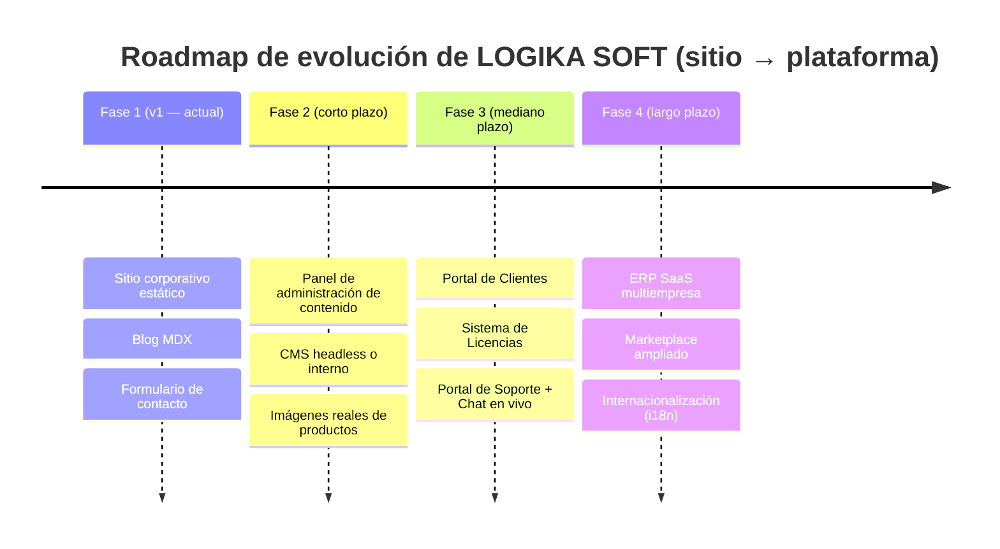

# Roadmap de Futuras Mejoras

Este documento es la hoja de ruta de producto y arquitectura para la evolución del sitio de LOGIKA SOFT más allá de su versión inicial (v1, ver [CHANGELOG.md](./CHANGELOG.md)). Cada iniciativa incluye: qué es, por qué importa, y las implicaciones arquitectónicas de implementarla sobre la base de código actual.

## 1. Visión general del roadmap

## 2. Portal de Clientes

**Qué es:** un área autenticada donde los clientes de LOGIKA SOFT (empresas que usan LogikaSoft ERP u otros productos) puedan iniciar sesión para consultar el estado de sus proyectos, facturas, tickets de soporte y descargar actualizaciones.

**Por qué importa:** es la extensión más natural del sitio actual — convierte el sitio de una herramienta puramente de marketing a una plataforma con valor recurrente para clientes existentes.

**Implicaciones arquitectónicas:**
- Requiere un sistema de **autenticación** (candidatos: [Auth.js](https://authjs.dev/) / NextAuth, o un proveedor gestionado como Clerk/Auth0) y una **base de datos** (hoy el proyecto no tiene ninguna — candidatos: PostgreSQL vía [Supabase](https://supabase.com/), [Neon](https://neon.tech/) o [Azure Database for PostgreSQL](https://azure.microsoft.com/products/postgresql), considerando que el resto del ecosistema de LOGIKA SOFT usa SQL Server/Azure).
- Debe vivir en un **nuevo grupo de rutas**, por ejemplo `app/(portal)/`, con su **propio `layout.tsx`** (barra lateral de navegación en lugar del Header/Footer públicos) — la arquitectura actual ya lo anticipa deliberadamente (ver la decisión documentada en [ARCHITECTURE.md](./ARCHITECTURE.md), sección 6, sobre por qué Header/Footer viven en `(marketing)/layout.tsx` y no en el layout raíz).
- Requiere `middleware.ts` en la raíz del proyecto para proteger las rutas de `(portal)` de accesos no autenticados.
- Estas rutas deben excluirse de `app/sitemap.ts` y bloquearse explícitamente en `app/robots.ts` (`disallow: "/portal"`).

## 3. Sistema de Licencias

**Qué es:** gestión de las licencias de uso de LogikaSoft ERP y demás productos por cliente (activación, vigencia, límite de usuarios/sucursales, renovación).

**Por qué importa:** es un requisito de negocio para monetizar LogikaSoft ERP como producto propio en lugar de solo como proyecto de desarrollo a la medida.

**Implicaciones arquitectónicas:**
- Depende del Portal de Clientes (sección 2) como interfaz de consulta, y de una base de datos para el estado de las licencias.
- Probablemente requiere un servicio de **pagos recurrentes** (Stripe es el estándar para SaaS B2B) integrado mediante Webhooks (Route Handlers de Next.js, ej. `app/api/webhooks/stripe/route.ts`) — a diferencia de la Server Action actual del formulario de contacto, un webhook de Stripe **sí** debe implementarse como Route Handler (`route.ts`), no como Server Action, porque debe responder a una petición HTTP externa firmada, no a una invocación desde el propio frontend.
- Debe integrarse con el **backend de LogikaSoft ERP** (.NET/Azure, ver [TECHNOLOGIES.md](./TECHNOLOGIES.md)) para validar licencias en tiempo real desde la aplicación de escritorio/web del ERP — este sitio Next.js pasaría a ser un cliente más de una API de licenciamiento centralizada, no la fuente de verdad.

## 4. ERP SaaS (multiempresa, multiinquilino)

**Qué es:** ya está esbozado como módulo "Próximamente" dentro de LogikaSoft ERP (ver `config/products.ts` → `modules: [{ name: "SaaS", status: "proximamente" }]`). Consiste en ofrecer LogikaSoft ERP como servicio alojado por LOGIKA SOFT (modelo *multi-tenant*), en lugar de una instalación on-premise por cliente.

**Por qué importa:** cambia el modelo de negocio de LogikaSoft ERP de "proyecto de implementación" a "suscripción recurrente", con mejor margen y escalabilidad.

**Implicaciones arquitectónicas (para este sitio, no para el ERP en sí, que es un proyecto .NET separado):**
- El sitio de marketing necesitará una página de "Registro / Prueba gratuita" que cree un *tenant* nuevo — probablemente vía una API expuesta por el backend del ERP, consumida desde una Server Action o Route Handler de este proyecto.
- El Portal de Clientes (sección 2) se convierte en el punto de entrada al ERP SaaS (SSO entre el sitio y la aplicación del ERP).

## 5. Panel Administrativo (para el equipo de LOGIKA SOFT)

**Qué es:** una interfaz interna para que el equipo de LOGIKA SOFT gestione clientes, licencias, leads del formulario de contacto y contenido del sitio, sin necesidad de hacer despliegues de código.

**Por qué importa:** hoy, gestionar contenido (productos, blog) requiere un Pull Request (ver [CMS.md](./CMS.md)) — esto es aceptable para el equipo técnico, pero no escala si el equipo de marketing/ventas crece.

**Implicaciones arquitectónicas:**
- Podría implementarse como una sección más de `app/(portal)/admin/` (protegida con roles de autenticación, no solo autenticación simple).
- Sería el punto natural para migrar la gestión de leads del formulario de contacto (hoy solo llegan por correo vía Resend, sin persistencia — ver [API.md](./API.md)) hacia un almacenamiento consultable (tabla `leads` en base de datos).

## 6. CMS (para contenido editorial)

**Qué es:** adoptar un CMS headless (Sanity, Contentful, o una alternativa auto-hospedada) para que contenido no técnico (productos, artículos de blog, testimonios) pueda editarse sin un despliegue de código.

**Por qué importa:** ver la decisión original de **no** usarlo en la v1, documentada en [ARCHITECTURE.md](./ARCHITECTURE.md) (sección 9) y [CMS.md](./CMS.md) — la razón para revisar esta decisión es la aparición de un equipo no técnico que necesite publicar autónomamente.

**Implicaciones arquitectónicas:**
- Migración incremental, no un "big bang": se puede introducir primero solo para el **blog** (el contenido que cambia con más frecuencia), manteniendo `config/*.ts` para catálogos más estables (productos, servicios) hasta que se justifique migrarlos también.
- `features/blog/mdx.ts` ya aísla la lógica de lectura de contenido detrás de funciones (`getAllPostsMeta`, `getPostRawBySlug`) — migrar a un CMS implicaría reemplazar la implementación interna de esas funciones (de leer `fs` a hacer `fetch` al CMS) **sin cambiar la interfaz que consumen las páginas**, gracias a la separación de capas ya existente (ver [ARCHITECTURE.md](./ARCHITECTURE.md)).
- Si se elige un CMS con webhooks de publicación, evaluar adoptar **ISR con revalidación por webhook** (`revalidatePath`/`revalidateTag`) en lugar del SSG puro actual, para que el contenido se actualice sin necesidad de un nuevo despliegue completo.

## 7. Internacionalización (i18n)

**Qué es:** soporte multi-idioma (mínimo español/inglés, considerando clientes fuera de Colombia).

**Por qué importa:** LOGIKA SOFT ya menciona trabajar con clientes en toda Latinoamérica (ver `config/faq.ts`); inglés abriría mercados adicionales.

**Implicaciones arquitectónicas:**
- Next.js soporta i18n de forma nativa en el App Router mediante segmentos dinámicos de locale (`app/[locale]/(marketing)/...`) — implicaría reestructurar **todas** las rutas actuales bajo un segmento `[locale]`, lo cual es un cambio estructural significativo, no incremental. Planificarlo como un esfuerzo dedicado, no como una tarea menor.
- Todo el contenido de `config/*.ts` y `content/blog/*.mdx` debe duplicarse o estructurarse por idioma (por ejemplo, `content/blog/es/` y `content/blog/en/`).
- El helper `buildMetadata()` (`utils/seo.ts`) necesitaría generar `alternates.languages` (hreflang) para cada página, señalando a los motores de búsqueda las versiones en cada idioma.

## 8. Marketplace ampliado

**Qué es:** el producto "Marketplace Hecho en Putumayo" (ya listado en `config/products.ts`) es hoy solo un ítem del catálogo de productos del sitio de marketing. Esta iniciativa se refiere a expandir sus capacidades como plataforma real (más categorías, más vendedores, pagos, logística).

**Implicaciones arquitectónicas:** es, en la práctica, un **producto separado** con su propia base de código (probablemente su propio proyecto Next.js o incluso otro stack), no una extensión de este sitio corporativo. Este sitio seguiría teniendo únicamente la tarjeta de producto que enlaza hacia esa plataforma externa.

## 9. Facturación Electrónica (como servicio propio, más allá del producto ya listado)

**Nota de alcance:** "Sistema de Facturación Electrónica" ya existe como producto en el catálogo (`config/products.ts`) y como servicio en `config/services.ts`. Esta sección del roadmap se refiere a una posible **integración directa** entre el sitio de LOGIKA SOFT y el motor real de facturación electrónica (por ejemplo, para que un cliente potencial pueda solicitar directamente la activación del servicio desde el sitio, con validación de NIT/RUT en tiempo real contra la DIAN u otra entidad).

**Implicaciones arquitectónicas:** requeriría una nueva Server Action o Route Handler que se comunique con la API del motor de facturación (posiblemente el mismo backend .NET del ERP), y probablemente un formulario más extenso que el actual de `/contacto`.

## 10. Portal de Soporte

**Qué es:** sistema de tickets de soporte técnico para clientes con productos ya implementados (relacionado con, pero independiente de, el Portal de Clientes de la sección 2).

**Implicaciones arquitectónicas:** podría integrarse con una herramienta de terceros ya madura (Zendesk, Freshdesk, o un sistema de tickets propio dentro del Portal de Clientes) en lugar de construirse desde cero — evaluar costo/beneficio de "comprar vs. construir" antes de iniciar.

## 11. Chat en vivo

**Qué es:** widget de chat en tiempo real en el sitio público (visible para visitantes anónimos, no solo clientes autenticados), como canal adicional de conversión junto al formulario de `/contacto`.

**Por qué importa:** reduce la fricción de conversión — un visitante indeciso puede resolver una duda puntual sin llenar un formulario completo.

**Implicaciones arquitectónicas (la iniciativa de menor esfuerzo de todo este roadmap):**
- Integración de un widget de terceros (Crisp, Intercom, Tawk.to) mediante un script en el layout de `(marketing)` — candidato directo a una variable `NEXT_PUBLIC_CHAT_WIDGET_ID` (ver [ENVIRONMENT_VARIABLES.md](./ENVIRONMENT_VARIABLES.md), sección 5).
- Debe evaluarse su impacto en Core Web Vitals ([PERFORMANCE.md](./PERFORMANCE.md)) — cargar el script de forma diferida (`next/script` con `strategy="lazyOnload"`) para no penalizar el LCP/INP de las páginas públicas.
- Debe agregarse a la futura Content Security Policy ([SECURITY.md](./SECURITY.md), sección 7.1) el dominio del proveedor elegido.

## 12. Blog dinámico (más allá de MDX estático)

**Qué es:** evolucionar el blog actual (archivos `.mdx` en el repositorio) hacia un modelo donde los artículos se publiquen sin un despliegue de código — ya cubierto conceptualmente en la sección 6 (CMS), se lista aquí como el caso de uso específico que más lo justificaría primero, dado que el blog es el contenido con mayor frecuencia de publicación esperada.

**Ruta de migración incremental recomendada:**
1. Mantener `features/blog/mdx.ts` como la única "puerta de entrada" al contenido del blog desde las páginas (ya es así hoy).
2. Reemplazar su implementación interna para leer de un CMS headless en lugar de `fs`, sin cambiar la firma de `getAllPostsMeta()`/`getPostRawBySlug()`.
3. Adoptar ISR con revalidación (`export const revalidate = 3600` o revalidación por webhook) en `app/(marketing)/blog/page.tsx` y `[slug]/page.tsx`, ya que el contenido dejaría de ser 100% conocido en build time.

## 13. Panel para administrar productos

**Qué es:** interfaz visual (dentro del futuro Panel Administrativo, sección 5) para que alguien no técnico pueda crear/editar/desactivar productos del catálogo sin editar `config/products.ts` directamente.

**Implicaciones arquitectónicas:** requiere migrar el catálogo de productos de un archivo TypeScript estático a una fuente de datos consultable en tiempo de ejecución (base de datos o CMS) — mismo patrón de migración incremental que el blog (sección 12), aplicado a `config/products.ts` en lugar de `content/blog/`.

## 14. Otras mejoras menores identificadas (no roadmap de producto, sino técnicas)

Consolidadas también en [MAINTENANCE.md](./MAINTENANCE.md), sección 8:

- Implementar las páginas `/politicas/privacidad` y `/politicas/terminos` (hoy enlazadas desde el Footer pero inexistentes) — **priorizar antes de cualquier lanzamiento público real**, ya que son páginas legalmente relevantes y su ausencia genera enlaces rotos (404) visibles a cualquier visitante.
- Incorporar imágenes reales de productos, portafolio y blog (ver [PERFORMANCE.md](./PERFORMANCE.md) y [CMS.md](./CMS.md)).
- Rate limiting y Content Security Policy (ver [SECURITY.md](./SECURITY.md)).
- Pruebas automatizadas (ver [TESTING.md](./TESTING.md)).
- Unificar la metadata de la página de Home con el helper `buildMetadata()` (ver [ROUTES.md](./ROUTES.md)).
- Persistencia de los leads del formulario de contacto más allá del correo electrónico (ver sección 5 de este documento).

## 15. Cómo priorizar estas iniciativas

Sugerencia de criterio (a validar con el negocio, no una decisión unilateral de ingeniería):

1. **Impacto en ingresos a corto plazo** (ej. Sistema de Licencias, si ya hay demanda de LogikaSoft ERP como SaaS) > **mejoras de eficiencia interna** (Panel Administrativo) > **alcance de mercado** (i18n).
2. Dentro de cada iniciativa, preferir siempre una **ruta de migración incremental** (como la descrita para el blog y productos, secciones 12–13) sobre una reescritura completa — la arquitectura actual (capas separadas: presentación / dominio / infraestructura, ver [ARCHITECTURE.md](./ARCHITECTURE.md)) fue diseñada explícitamente para permitir estas migraciones sin reescribir las páginas ni los componentes de presentación.
3. Cualquier iniciativa que introduzca autenticación o datos de clientes reales (Portal de Clientes, Panel Administrativo, Sistema de Licencias) debe pasar primero por una revisión de seguridad completa (ampliar [SECURITY.md](./SECURITY.md)), dado que la superficie de riesgo del proyecto cambia fundamentalmente en el momento en que existan datos de usuarios autenticados.
