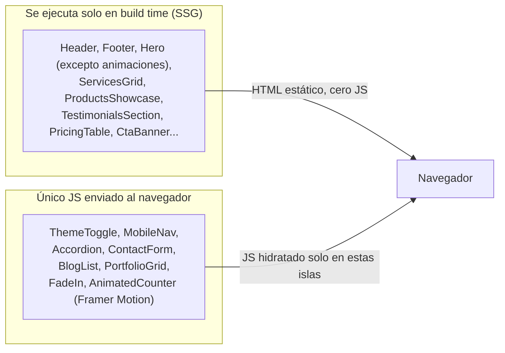

# Rendimiento

Este documento describe las decisiones de rendimiento ya implementadas y las que quedan pendientes para cuando el sitio incorpore activos reales (imágenes de productos, logo, fotografías de casos de éxito).

## 1. Objetivo

Lighthouse ≥ 95 en las categorías de Performance, Accessibility, Best Practices y SEO, en desktop y mobile, para las rutas principales (`/`, `/productos`, `/productos/[slug]`, `/blog`, `/blog/[slug]`, `/contacto`).

> **Estado actual:** no se ha ejecutado todavía una auditoría de Lighthouse formal contra un despliegue de producción real (solo verificación manual en desarrollo, ver [TESTING.md](./TESTING.md)). Ejecutarla como parte del checklist de cada despliegue (sección 7 de este documento).

## 2. Server Components por defecto (la optimización más importante)

Como se detalla en [ARCHITECTURE.md](./ARCHITECTURE.md), la gran mayoría de los componentes del sitio son **React Server Components**, lo que significa que:

- Su código (JSX + lógica) se ejecuta y renderiza a HTML **en el servidor, en build time** (todas las páginas son SSG). El JavaScript de esos componentes **nunca se envía al navegador**.
- Solo los componentes marcados `"use client"` contribuyen al bundle de JavaScript que el navegador debe descargar, parsear y ejecutar.



**Implicación práctica para cualquier desarrollador que añada un componente nuevo:** antes de escribir `"use client"` por costumbre, verificar si realmente se necesita (ver criterio en [ARCHITECTURE.md](./ARCHITECTURE.md), sección 3.1). Cada `"use client"` innecesario aumenta el JavaScript que todos los visitantes deben descargar.

## 3. Renderizado estático (SSG) en el 100% de las rutas

Confirmado por la salida real de `pnpm build` (ver [ARCHITECTURE.md](./ARCHITECTURE.md), sección 2):

```
┌ ○ /
├ ○ /blog
│ ├ ● /blog/senales-tu-empresa-necesita-un-erp
│ ├ ● /blog/facturacion-electronica-guia-rapida
│ └ ● /blog/software-a-la-medida-vs-software-generico
├ ○ /productos
│ ├ ● /productos/logikasoft-erp
│ └ ● [+7 más]
└ ...
```

- `○` (Static): HTML generado una sola vez en build time, servido igual para todos los visitantes — es la opción más rápida posible (equivalente a servir un archivo `.html` estático desde una CDN).
- `●` (SSG con parámetros): igual que arriba, pero para cada `slug` conocido de `generateStaticParams`.

**Consecuencia directa:** el TTFB (*Time to First Byte*) de cualquier página del sitio depende únicamente de la latencia de red hasta la CDN/servidor, no de tiempo de cómputo del servidor en cada visita — no hay consultas a base de datos, ni llamadas a APIs externas, en el camino crítico de renderizado de ninguna página pública.

## 4. Code splitting

Next.js hace *code splitting* automático **por ruta**: el JavaScript de `/blog/[slug]` no se descarga al visitar `/productos`, y viceversa. Esto es automático con el App Router y no requiere configuración manual.

Adicionalmente, dentro de cada página, solo se descarga el JavaScript de los Client Components realmente presentes en esa página (ver sección 2) — por ejemplo, `/empresa` (sin ningún formulario ni filtro) descarga sustancialmente menos JavaScript de interactividad que `/contacto` (con React Hook Form + Zod) o `/blog` (con el filtro de `BlogList`).

## 5. Fuentes (next/font)

La fuente Montserrat se carga con `next/font/google` (`app/layout.tsx`), lo que proporciona automáticamente:

- **Auto-hosting:** la fuente se descarga en build time y se sirve desde el propio dominio — cero peticiones a `fonts.googleapis.com` en tiempo de ejecución (mejora rendimiento *y* privacidad, ya que el navegador del visitante nunca contacta a Google directamente).
- **`display: "swap"`:** el texto se muestra inmediatamente con una fuente de respaldo del sistema y se sustituye por Montserrat en cuanto está lista, evitando texto invisible (*FOIT — Flash of Invisible Text*).
- **Sin Cumulative Layout Shift (CLS) por fuentes:** `next/font` calcula automáticamente métricas de tamaño de la fuente de respaldo para minimizar el salto visual al intercambiar fuentes.

## 6. Imágenes — estado actual y plan de optimización futura

**Estado actual:** el sitio **no usa ninguna imagen rasterizada real** todavía (ni `next/image` ni ``). Todos los "espacios de imagen" de productos, portafolio y blog se representan con el componente `ProductVisual` (`components/sections/product-visual.tsx`): un `<div>` con degradado CSS de marca + un ícono de Lucide, sin ningún archivo de imagen que descargar. Esto es una consecuencia directa de que LOGIKA SOFT todavía no ha entregado fotografías/capturas reales de sus productos (ver [FUTURE_IMPROVEMENTS.md](./FUTURE_IMPROVEMENTS.md)).

**Ventaja incidental:** cero peso de imágenes en el sitio actual — probablemente uno de los factores por los que el sitio ya debería puntuar muy alto en Lighthouse Performance incluso sin optimización adicional.

**Plan obligatorio para cuando se incorporen imágenes reales:**

1. **Usar siempre `next/image` (`import Image from "next/image"`), nunca ``.** `next/image` proporciona automáticamente:
   - Redimensionado y conversión a formatos modernos (WebP/AVIF) servidos según el navegador del visitante.
   - `loading="lazy"` por defecto para toda imagen fuera del viewport inicial.
   - Reserva de espacio (`width`/`height` obligatorios, o `fill` + contenedor con `aspect-ratio`) para eliminar el Cumulative Layout Shift.
2. Marcar `priority` únicamente en la imagen más importante del *above the fold* de cada página (por ejemplo, una futura imagen de Hero), nunca en imágenes de tarjetas dentro de una grilla.
3. Colocar los archivos siguiendo la convención ya definida en [FOLDER_STRUCTURE.md](./FOLDER_STRUCTURE.md) (`public/images/products/`, `public/images/portfolio/`, `public/images/blog/`).
4. Actualizar el campo `image`/`coverImage` correspondiente en `config/products.ts`, `config/portfolio.ts` o el frontmatter de cada `.mdx`.
5. Reemplazar (o extender condicionalmente) `ProductVisual` para que renderice `next/image` cuando el dato `image` apunte a un archivo real, manteniendo el degradado como *fallback* si no existe imagen.

## 7. Lazy loading de contenido interactivo

Framer Motion se usa con `whileInView`/`useInView` (`FadeIn`, `AnimatedCounter`) — las animaciones (y el trabajo de cómputo asociado) solo se activan cuando el elemento realmente entra en el viewport, no de forma anticipada para toda la página al cargar.

**Pendiente de evaluar (no crítico en el tamaño actual del sitio):** si en el futuro se agregan bloques pesados poco visitados (por ejemplo, un reproductor de video incrustado en una página de producto), usar `next/dynamic` con `ssr: false` para diferir su JavaScript hasta que sea estrictamente necesario.

## 8. Caching

- **Nivel CDN/edge:** todas las páginas estáticas (`○`/`●`) generan HTML que puede cachearse indefinidamente en una CDN hasta el próximo despliegue (no hay revalidación por tiempo — ver [ARCHITECTURE.md](./ARCHITECTURE.md), sección 2, sobre por qué no se usa ISR todavía).
- **Nivel de build de Next.js:** los assets estáticos (`_next/static/*`) se sirven con hashes de contenido en el nombre de archivo, lo que permite cabeceras de caché `immutable` de muy larga duración sin riesgo de servir una versión obsolete tras un despliegue — esto lo gestiona Next.js automáticamente.
- **Server Action de contacto:** no cacheable ni debe cachearse (es una mutación); Next.js no la cachea por defecto.

## 9. Core Web Vitals — cómo el proyecto los atiende

| Métrica | Qué mide | Cómo se atiende en este proyecto |
|---|---|---|
| **LCP** (Largest Contentful Paint) | Tiempo hasta que el elemento más grande visible termina de renderizar | HTML pre-renderizado (SSG) servido de inmediato; sin imágenes pesadas que bloqueen el LCP actualmente; fuente con `display: swap`. |
| **CLS** (Cumulative Layout Shift) | Saltos visuales inesperados durante la carga | `next/font` sin salto de fuente; `ProductVisual` con altura fija (`h-44`, `h-72`, etc.) en lugar de depender del tamaño natural de una imagen; `FieldError` reserva su propio espacio en el formulario. |
| **INP** (Interaction to Next Paint) | Latencia de respuesta a interacciones del usuario | Uso de `useTransition` en `ContactForm` para no bloquear la UI durante el envío; Server Components minimizan el JavaScript total que el hilo principal debe procesar antes de que la página sea interactiva. |

## 10. Auditoría de Lighthouse — cómo ejecutarla

1. Desplegar o levantar el build de producción localmente:
   ```bash
   pnpm build && pnpm start
   ```
2. Abrir Chrome DevTools → pestaña **Lighthouse** → seleccionar Mobile y Desktop por separado → **Analyze page load**.
3. Repetir para al menos: `/`, `/productos/logikasoft-erp`, `/blog/senales-tu-empresa-necesita-un-erp`, `/contacto`.
4. Registrar los resultados; si alguna categoría cae por debajo de 95, documentar la causa raíz en [TROUBLESHOOTING.md](./TROUBLESHOOTING.md) antes de continuar con nuevas funcionalidades.

> Ejecutar siempre contra `pnpm build && pnpm start` (build de producción), **nunca** contra `pnpm dev` — el modo de desarrollo incluye instrumentación (Fast Refresh, mapas de fuente sin minificar) que distorsiona completamente las métricas de Lighthouse hacia peor de lo que será en producción real.

## 11. Presupuesto de rendimiento (performance budget) sugerido

| Recurso | Límite sugerido |
|---|---|
| JavaScript total por página (comprimido) | < 150 KB |
| CSS total (comprimido) | < 50 KB (Tailwind purga automáticamente las clases no usadas) |
| Peso de imagen individual (cuando se incorporen) | < 200 KB tras optimización de `next/image` |
| Fuentes | 1 sola familia (Montserrat), máximo 4 pesos cargados |

No hay todavía una herramienta automatizada (como `bundlesize` o un chequeo de CI) que haga cumplir este presupuesto — evaluar incorporarlo en [MAINTENANCE.md](./MAINTENANCE.md) si el proyecto crece.
