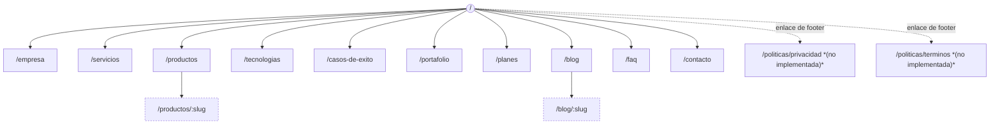

# Mapa de Rutas

Este documento enumera **todas** las rutas del sitio, qué renderiza cada una, su configuración de metadata/SEO, el layout que utiliza y su estrategia de renderizado.

## 1. Diagrama de navegación

> **Nota:** el `Footer` (`config/site.ts → footerNav.legal`) enlaza a `/politicas/privacidad` y `/politicas/terminos`, pero estas rutas **no tienen página implementada todavía** — hoy resuelven en un 404. Ver el pendiente en [FUTURE_IMPROVEMENTS.md](./FUTURE_IMPROVEMENTS.md) y priorizarlo antes de un lanzamiento público real (son páginas legalmente relevantes).

## 2. Todas las rutas del grupo `(marketing)`

Todas comparten el layout `app/(marketing)/layout.tsx` (Header + `<main>` + Footer), que a su vez está envuelto por el layout raíz `app/layout.tsx` (fuente, `ThemeProvider`, JSON-LD `Organization`).

| Ruta | Archivo | Renderizado | Título (`<title>`) |
|---|---|---|---|
| `/` | `app/(marketing)/page.tsx` | `○` Estático (SSG) | *"LOGIKA SOFT — Software empresarial que impulsa tu crecimiento"* (título por defecto del layout raíz; ver nota abajo) |
| `/empresa` | `app/(marketing)/empresa/page.tsx` | `○` Estático | "Empresa \| LOGIKA SOFT" |
| `/servicios` | `app/(marketing)/servicios/page.tsx` | `○` Estático | "Servicios \| LOGIKA SOFT" |
| `/productos` | `app/(marketing)/productos/page.tsx` | `○` Estático | "Productos \| LOGIKA SOFT" |
| `/productos/[slug]` | `app/(marketing)/productos/[slug]/page.tsx` | `●` SSG (8 rutas vía `generateStaticParams`) | `"{nombre del producto} \| LOGIKA SOFT"` |
| `/tecnologias` | `app/(marketing)/tecnologias/page.tsx` | `○` Estático | "Tecnologías \| LOGIKA SOFT" |
| `/casos-de-exito` | `app/(marketing)/casos-de-exito/page.tsx` | `○` Estático | "Casos de Éxito \| LOGIKA SOFT" |
| `/portafolio` | `app/(marketing)/portafolio/page.tsx` | `○` Estático | "Portafolio \| LOGIKA SOFT" |
| `/planes` | `app/(marketing)/planes/page.tsx` | `○` Estático | "Planes \| LOGIKA SOFT" |
| `/blog` | `app/(marketing)/blog/page.tsx` | `○` Estático | "Blog \| LOGIKA SOFT" |
| `/blog/[slug]` | `app/(marketing)/blog/[slug]/page.tsx` | `●` SSG (3 rutas vía `generateStaticParams`) | `"{título del artículo} \| LOGIKA SOFT"` |
| `/faq` | `app/(marketing)/faq/page.tsx` | `○` Estático | "Preguntas Frecuentes \| LOGIKA SOFT" |
| `/contacto` | `app/(marketing)/contacto/page.tsx` | `○` Estático | "Contacto \| LOGIKA SOFT" |

> **Nota sobre `/`:** a diferencia de todas las demás páginas, `app/(marketing)/page.tsx` define su `metadata` como un objeto literal (`{ title: "Inicio", alternates: { canonical: "/" } }`) en lugar de usar el helper `buildMetadata()` (ver [SEO.md](./SEO.md)). Como el `title` del layout raíz usa la plantilla `"%s | LOGIKA SOFT"`, el resultado real en el navegador es **"Inicio | LOGIKA SOFT"**. Esto es funcionalmente correcto pero **inconsistente** con el resto de páginas (que sí usan `buildMetadata`, y por lo tanto también generan automáticamente Open Graph y Twitter Cards). Ver la recomendación de unificarlo en [MAINTENANCE.md](./MAINTENANCE.md).

## 3. Rutas de archivo especial (fuera del grupo `(marketing)`)

| Ruta | Archivo | Descripción |
|---|---|---|
| `/sitemap.xml` | `app/sitemap.ts` | Generado dinámicamente: incluye las 13 rutas estáticas + 8 productos + 3 artículos de blog. |
| `/robots.txt` | `app/robots.ts` | `Allow: /` para todos los user-agents + referencia al sitemap. |
| `/favicon.ico` | `app/favicon.ico` | Ícono de pestaña del navegador (placeholder por defecto de Next.js — reemplazar cuando se reciba el manual de marca). |

## 4. Detalle por ruta

### `/` — Home

- **Componentes:** `Hero`, `CompanyOverview`, `ServicesGrid` (limit 6, con CTA), `ProductsShowcase` (6 productos: destacados primero), `TechStack`, `SuccessStoriesSection` (con CTA), `TestimonialsSection`, `PricingTable`, `CtaBanner`.
- **Datos:** `getFeaturedProducts()` + resto de `products` (`config/products.ts`), recortado a 6 con `.slice(0, 6)`.
- **SEO:** ver nota de la sección 2. No define Open Graph/Twitter Cards propios (usa los del layout raíz).

### `/empresa`

- **Componentes:** `Section`/`SectionHeading` (misión, visión), bloque de historia, grilla de 4 valores (`Card`+`CardIcon`), grilla de 3 razones ("Por qué elegirnos"), `CtaBanner`.
- **Contenido:** texto fijo dentro del propio archivo de la página (no está en `config/`, a diferencia de servicios/productos) — es contenido institucional que cambia con muy poca frecuencia.

### `/servicios`

- **Componentes:** `ServicesGrid` (sin `limit`, muestra los 12), `CtaBanner`.
- **Datos:** `config/services.ts`.

### `/productos`

- **Componentes:** `ProductsShowcase` (sin `items`, muestra los 8), `CtaBanner`.
- **Datos:** `config/products.ts`.

### `/productos/[slug]`

- **`generateStaticParams`:** retorna los 8 `slug` de `config/products.ts`.
- **`generateMetadata`:** por producto — título, descripción y `path` dinámicos.
- **Contenido dinámico:** hero con nombre/tagline/badge de estado, grilla de características (`product.features`), y **si el producto tiene `modules`** (únicamente `logikasoft-erp`), una sección adicional con la grilla de los 19 módulos del ERP, marcando visualmente los que están en estado `"proximamente"`.
- **JSON-LD:** `Product` (`@type: "Product"`) inyectado inline.
- **404:** si el `slug` no existe en `config/products.ts`, llama a `notFound()` de `next/navigation`.

### `/tecnologias`

- **Componentes:** grilla de tecnologías agrupadas por categoría (`Backend`, `Frontend`, `Cloud & DevOps`, `Datos`), seguida del componente `TechStack` (marquee), `CtaBanner`.
- **Datos:** `config/technologies.ts`, agrupado en tiempo de renderizado con la función local `groupByCategory`.

### `/casos-de-exito`

- **Componentes:** `SuccessStoriesSection` (sin `showCta`), `TestimonialsSection`, `CtaBanner`.
- **Datos:** `config/success-stories.ts`.

### `/portafolio`

- **Componentes:** `PortfolioGrid` (Client Component con filtro de categoría), `CtaBanner`.
- **Datos:** `config/portfolio.ts`.

### `/planes`

- **Componentes:** `PricingTable`, `CtaBanner`.
- **Datos:** `config/pricing.ts` (3 planes: Starter, Business —destacado—, Enterprise).

### `/blog`

- **Componentes:** `BlogList` (Client Component con búsqueda y filtro de categoría).
- **Datos:** `getAllPostsMeta()` y `getAllCategories()` de `features/blog/mdx.ts`, leídos en el servidor a partir de `content/blog/*.mdx`.

### `/blog/[slug]`

- **`generateStaticParams`:** retorna los `slug` de todos los archivos `.mdx` existentes.
- **`generateMetadata`:** título, descripción (`excerpt`) e imagen (`coverImage`) dinámicos.
- **Renderizado del contenido:** `compileMDX` de `next-mdx-remote/rsc`, compilado como Server Component (sin JavaScript de MDX enviado al cliente).
- **JSON-LD:** `Article` (`@type: "Article"`).
- **404:** si el `slug` no corresponde a ningún archivo `.mdx`, llama a `notFound()`.

### `/faq`

- **Componentes:** `Accordion` (Client Component), dentro de un `Section` con `containerClassName="max-w-3xl"` (ancho reducido para mejorar la legibilidad).
- **Datos:** `config/faq.ts`.
- **JSON-LD:** `FAQPage`, generado a partir del mismo array `faqItems` — garantiza que el JSON-LD nunca queda desincronizado del contenido visible.

### `/contacto`

- **Componentes:** `ContactForm` (Client Component — React Hook Form + Zod + Server Action), lista de canales de contacto (correo, teléfono, WhatsApp, ubicación), mapa embebido de OpenStreetMap (`<iframe>`).
- **Server Action invocada:** `submitContactForm` (`app/actions/contact.ts`) — ver [API.md](./API.md).

---

## 5. Layouts utilizados por cada ruta

| Layout | Archivo | Aplica a |
|---|---|---|
| Layout raíz | `app/layout.tsx` | Todas las rutas de la aplicación (incluye `sitemap.ts`/`robots.ts`, que no son páginas HTML y no lo consumen directamente) |
| Layout de marketing | `app/(marketing)/layout.tsx` | Todas las rutas listadas en la sección 2 (Header + Footer públicos) |

No existe todavía ningún otro grupo de rutas con un layout distinto — ver el plan de un futuro `app/(portal)/layout.tsx` en [FUTURE_IMPROVEMENTS.md](./FUTURE_IMPROVEMENTS.md).

## 6. Cómo agregar una ruta nueva

Ver la guía paso a paso en [MAINTENANCE.md](./MAINTENANCE.md#agregar-una-nueva-página), que cubre: crear el archivo `page.tsx`, exportar `metadata` con `buildMetadata()`, agregar la ruta a `app/sitemap.ts` (si es una ruta estática nueva, no dinámica), y enlazarla desde `mainNav`/`footerNav` si corresponde.
