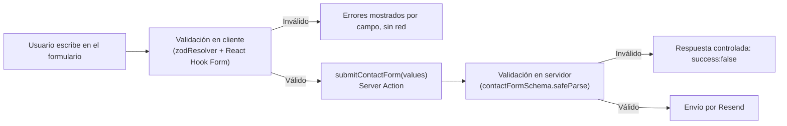

# Seguridad

Este documento describe el estado actual de seguridad de la aplicación, qué protecciones ya están implementadas, cuáles son riesgos aceptados conscientemente en esta versión, y qué se debe implementar antes de escalar el sitio (por ejemplo, antes de conectar el futuro portal de clientes).

## 1. Superficie de ataque actual

El sitio es predominantemente **contenido estático** (ver [ARCHITECTURE.md](./ARCHITECTURE.md)). La única superficie dinámica real es:

1. La Server Action `submitContactForm` (`app/actions/contact.ts`).
2. El envío de correo saliente a través de Resend.

No existe base de datos, autenticación de usuarios, ni contenido generado por usuarios visible públicamente (comentarios, reseñas, etc.) en esta versión — lo que reduce significativamente el riesgo comparado con una aplicación transaccional típica.

## 2. Validación de entradas

### 2.1. Doble validación del formulario de contacto



**Por qué la validación en servidor es la que realmente importa:** una Server Action de Next.js se compila hacia un endpoint HTTP real (`POST` a una ruta interna generada por el framework). Cualquier persona con las herramientas de desarrollador del navegador (o `curl`) puede invocar ese endpoint directamente, **sin pasar por el formulario ni por la validación de React Hook Form**. Por eso `contactFormSchema.safeParse(values)` se ejecuta *de nuevo*, íntegramente, dentro de la Server Action (`app/actions/contact.ts`) — es la verdadera barrera de seguridad, no una duplicación innecesaria.

### 2.2. Esquema de validación (`features/contact/schema.ts`)

| Campo | Regla |
|---|---|
| `name` | string, 2–100 caracteres |
| `email` | formato de correo válido (`z.email()`) |
| `company` | opcional, máx. 100 caracteres |
| `phone` | opcional, máx. 30 caracteres |
| `serviceInterest` | string no vacío (selección de una lista cerrada en la UI) |
| `message` | 10–2000 caracteres |

Los límites máximos de longitud (`max()`) existen específicamente para evitar payloads anormalmente grandes que pudieran usarse para saturar el servicio de correo o abusar del envío de datos.

## 3. Protección contra XSS (Cross-Site Scripting)

- **React escapa por defecto** todo contenido interpolado en JSX (`{variable}`), lo que elimina la clase de vulnerabilidad XSS más común de forma automática en el 100% de los componentes del sitio.
- **Único uso de `dangerouslySetInnerHTML` en todo el proyecto:** la inyección de bloques `<script type="application/ld+json">` para datos estructurados (JSON-LD) en `app/layout.tsx`, `app/(marketing)/faq/page.tsx`, `app/(marketing)/productos/[slug]/page.tsx` y `app/(marketing)/blog/[slug]/page.tsx`.
  - **Por qué es seguro en este caso:** el contenido pasado a `JSON.stringify()` proviene siempre de datos **propios y controlados** (`config/*.ts`, frontmatter de `content/blog/*.mdx`), nunca de input directo de un visitante del sitio. `JSON.stringify` además escapa correctamente comillas y caracteres especiales dentro del JSON resultante.
  - **Regla para el futuro:** si alguna vez se construye un JSON-LD a partir de datos que un usuario puede escribir (por ejemplo, una reseña de cliente enviada por formulario), **nunca** insertarlo directamente — sanitizar o, mejor, regenerar el JSON-LD solo a partir de campos ya validados por Zod, nunca de texto libre sin escapar.
- **Contenido del blog (MDX):** se compila con `next-mdx-remote/rsc` (`compileMDX`) a partir de archivos `.mdx` que **solo el equipo de desarrollo puede crear o modificar** (viven en el repositorio de código, requieren un despliegue para publicarse). No hay una vía por la que un visitante externo pueda inyectar MDX/HTML arbitrario en el blog en esta versión — si en el futuro el blog se conecta a un CMS con edición por terceros no confiables, se debe evaluar sanitización adicional del HTML resultante antes de renderizarlo.

## 4. Protección contra CSRF

Las **Server Actions de Next.js incluyen protección CSRF nativa**: el framework verifica automáticamente que el origen (`Origin`/`Host`) de la petición que invoca una Server Action coincida con el origen que sirvió la página, rechazando invocaciones cross-origin sin necesidad de un token CSRF manual. Esto aplica directamente a `submitContactForm`. No se requiere configuración adicional, pero es importante **no** reemplazar esta Server Action por un `fetch` manual a una API Route sin recrear una protección equivalente.

## 5. Gestión de secretos

- `RESEND_API_KEY` es el único secreto del proyecto. Ver el detalle completo de su manejo en [ENVIRONMENT_VARIABLES.md](./ENVIRONMENT_VARIABLES.md).
- `services/resend.ts` centraliza el acceso a esta variable: **ningún otro archivo del proyecto lee `process.env.RESEND_API_KEY` directamente**, lo que facilita rotarla o migrarla a otro mecanismo de secretos (Azure Key Vault, AWS Secrets Manager) en el futuro sin tocar más de un archivo.
- El SDK de Resend solo se instancia dentro de una Server Action (entorno de servidor) — nunca se importa `services/resend.ts` desde un Client Component, por lo que la clave nunca llega al bundle de JavaScript del navegador.

## 6. Rate limiting

**No implementado en esta versión.** El endpoint generado por `submitContactForm` no tiene actualmente ningún límite de frecuencia de invocación por IP/usuario, lo que lo expone a:

- Spam del formulario de contacto (envíos automatizados repetidos).
- Abuso del cupo de envío de la cuenta de Resend.

**Recomendación de implementación futura** (priorizar antes de un lanzamiento con tráfico significativo):

- **Opción simple (sin infraestructura adicional):** usar el *rate limiting* nativo de Vercel (si se despliega ahí) a nivel de Edge, o un middleware de Next.js (`middleware.ts`) con un almacén en memoria/KV (Vercel KV, Upstash Redis) que limite, por ejemplo, a 5 envíos por IP cada 10 minutos.
- **Opción adicional recomendada:** agregar un CAPTCHA invisible (Cloudflare Turnstile o similar) en el formulario de contacto antes de invocar la Server Action, especialmente si se detecta spam real en producción.

Ver este punto priorizado en [FUTURE_IMPROVEMENTS.md](./FUTURE_IMPROVEMENTS.md).

## 7. Cabeceras HTTP de seguridad

**Estado actual:** el proyecto **no define cabeceras de seguridad personalizadas** todavía (no hay bloque `headers()` en `next.config.ts`). Next.js ya envía algunas cabeceras razonables por defecto, pero se recomienda añadir explícitamente las siguientes antes de un lanzamiento público:

```ts
// next.config.ts (propuesta — no implementado aún)
import type { NextConfig } from "next";

const securityHeaders = [
  { key: "X-Content-Type-Options", value: "nosniff" },
  { key: "X-Frame-Options", value: "SAMEORIGIN" },
  { key: "Referrer-Policy", value: "strict-origin-when-cross-origin" },
  { key: "Permissions-Policy", value: "camera=(), microphone=(), geolocation=()" },
  {
    key: "Strict-Transport-Security",
    value: "max-age=63072000; includeSubDomains; preload",
  },
];

const nextConfig: NextConfig = {
  async headers() {
    return [{ source: "/:path*", headers: securityHeaders }];
  },
};

export default nextConfig;
```

### 7.1. Content Security Policy (CSP)

**No implementada todavía.** Es la cabecera de seguridad más compleja de introducir correctamente porque el sitio usa:

- Scripts inline de `next/font` y del `<script type="application/ld+json">` (JSON-LD).
- Un `<iframe>` de OpenStreetMap en `/contacto` (requiere permitir ese origen en `frame-src`).
- Los scripts propios generados por Next.js/Turbopack (requieren `'self'`, y en desarrollo, `'unsafe-eval'` para HMR).

**Propuesta de CSP a evaluar cuidadosamente en un entorno de staging antes de producción** (probar exhaustivamente, ya que una CSP mal configurada puede romper la hidratación de React):

```
default-src 'self';
script-src 'self' 'unsafe-inline';
style-src 'self' 'unsafe-inline';
img-src 'self' data:;
frame-src https://www.openstreetmap.org;
connect-src 'self';
```

Se documenta como pendiente explícito en [FUTURE_IMPROVEMENTS.md](./FUTURE_IMPROVEMENTS.md) en lugar de implementarse a ciegas, dado que requiere pruebas manuales de regresión en todas las páginas (especialmente el mapa embebido y el JSON-LD).

## 8. Sanitización de datos que salen del sistema (correo)

El cuerpo del correo enviado por `submitContactForm` se construye como **texto plano** (`text: [...].join("\n")`), no como HTML:

```ts
await resend.emails.send({
  from: `${siteConfig.name} <notificaciones@logikasoft.com>`,
  to: siteConfig.contact.email,
  replyTo: email,
  subject: `Nueva solicitud de cotización — ${name}`,
  text: [ /* ... */ ].join("\n"),
});
```

**Por qué esto es una decisión de seguridad, no solo de simplicidad:** al usar el campo `text` (no `html`) del SDK de Resend, cualquier intento de un remitente malicioso de inyectar HTML/JavaScript en los campos `name`, `company`, `phone` o `message` se renderiza como texto literal en el cliente de correo del destinatario, sin riesgo de que se interprete como HTML activo. Si en el futuro se decide enviar el correo en formato HTML (por una plantilla más visual), **es obligatorio** escapar manualmente (`encodeHTMLEntities` o similar) cada campo antes de interpolarlo en el HTML del correo.

El campo `replyTo: email` usa el correo que el propio remitente escribió en el formulario — esto es intencional (permite responder directamente al interesado), pero significa que el campo `email` **no está verificado** (no hay confirmación de que el remitente sea dueño de esa dirección). Es un riesgo bajo y aceptado para un formulario de contacto B2B; no se recomienda añadir verificación de correo (que agregaría fricción) a menos que se detecte abuso real.

## 9. Dependencias y cadena de suministro (supply chain)

- El proyecto usa `pnpm`, que verifica la integridad de los paquetes descargados contra el lockfile (`pnpm-lock.yaml`) en cada instalación.
- **Recomendación de proceso:** ejecutar `pnpm audit` periódicamente (por ejemplo, mensualmente o en cada actualización de dependencias) para detectar vulnerabilidades conocidas en las dependencias, y revisar el detalle en [MAINTENANCE.md](./MAINTENANCE.md).
- No instalar dependencias nuevas sin revisar: número de descargas semanales, fecha del último publish, y si el paquete tiene *typosquatting* conocido (nombre muy similar a uno popular).

## 10. Resumen de riesgos aceptados en esta versión (v1)

| Riesgo | Severidad | Mitigación actual | Acción recomendada |
|---|---|---|---|
| Sin rate limiting en el formulario de contacto | Media | Ninguna | Implementar antes de tráfico alto (sección 6) |
| Sin CSP | Media | Escapado automático de React + `text` plano en correos | Implementar y probar exhaustivamente (sección 7.1) |
| Correo de contacto sin verificación de remitente | Baja | `replyTo` usa el correo ingresado, sin verificar | Aceptado; monitorear abuso |
| Sin cabeceras `HSTS`/`X-Frame-Options` explícitas | Baja–Media | Depende de la plataforma de despliegue (Vercel añade algunas por defecto) | Añadir explícitamente en `next.config.ts` (sección 7) |

## 11. Checklist de seguridad antes de una nueva funcionalidad

- [ ] ¿La nueva funcionalidad acepta input de un usuario? → debe validarse con Zod **en el servidor**, no solo en el cliente.
- [ ] ¿Se agrega un nuevo secreto/API key? → documentarlo en [ENVIRONMENT_VARIABLES.md](./ENVIRONMENT_VARIABLES.md) y centralizarlo en `services/`.
- [ ] ¿Se renderiza contenido dinámico como HTML (`dangerouslySetInnerHTML`)? → confirmar que el origen del dato es confiable/controlado, nunca input directo de un usuario sin sanitizar.
- [ ] ¿La funcionalidad expone un nuevo endpoint (Server Action o Route Handler) que pueda ser invocado con alta frecuencia? → evaluar rate limiting.
- [ ] ¿Cambia el formato del correo saliente a HTML? → escapar manualmente cada campo interpolado (sección 8).
