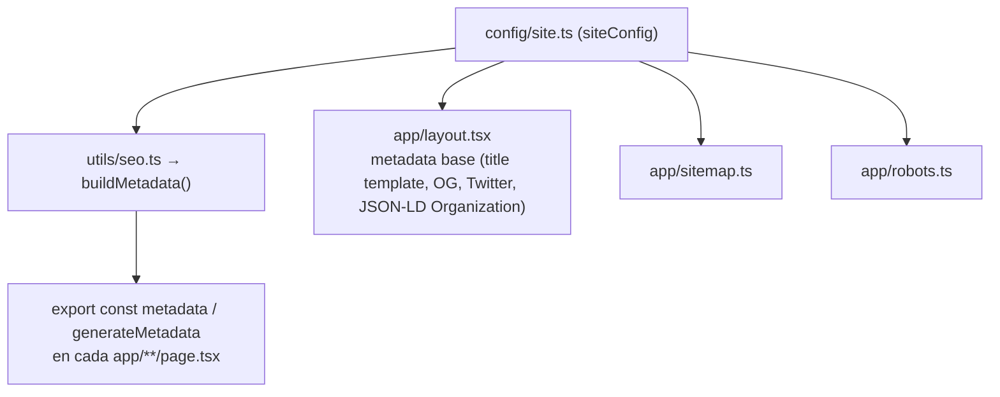

# SEO Técnico

Este documento describe la estrategia de SEO implementada y las buenas prácticas que deben mantenerse al agregar contenido nuevo.

## 1. Arquitectura de metadata



### 1.1. `buildMetadata()` — helper central

Definido en `utils/seo.ts`. Recibe `{ title, description, path, image? }` y retorna un objeto `Metadata` de Next.js completo, incluyendo:

- `title`, `description`
- `alternates.canonical` (siempre igual a `path`)
- `openGraph` (título, descripción, `url` absoluta construida con `siteConfig.url`, `siteName`, imagen 1200×630)
- `twitter` (`card: "summary_large_image"`, título, descripción, imagen)

```ts
export const metadata: Metadata = buildMetadata({
  title: "Servicios",
  description: "Desarrollo de software, ERP empresarial, sistemas POS...",
  path: "/servicios",
});
```

**Toda página nueva debe usar este helper**, salvo el caso especial de `/` documentado en [ROUTES.md](./ROUTES.md) (pendiente de unificar — ver [MAINTENANCE.md](./MAINTENANCE.md)).

### 1.2. Metadata del layout raíz

`app/layout.tsx` define la `metadata` base que heredan todas las páginas que no la sobrescriben:

- `metadataBase: new URL(siteConfig.url)` — permite que las rutas relativas de imágenes (`/images/...`) se resuelvan a URLs absolutas automáticamente en Open Graph.
- `title.default` y `title.template: "%s | LOGIKA SOFT"` — cualquier página que defina `title: "Servicios"` renderiza `"Servicios | LOGIKA SOFT"` en la pestaña del navegador.
- `keywords`, `authors`, `openGraph`, `twitter`, `icons` a nivel de sitio.

### 1.3. Metadata dinámica (`generateMetadata`)

Usada en las dos rutas con contenido dinámico:

- `app/(marketing)/productos/[slug]/page.tsx` — título/descripción del producto específico.
- `app/(marketing)/blog/[slug]/page.tsx` — título/`excerpt`/`coverImage` del artículo específico.

```ts
export async function generateMetadata({
  params,
}: {
  params: Promise<{ slug: string }>;
}): Promise<Metadata> {
  const { slug } = await params;
  const product = getProductBySlug(slug);
  if (!product) return {};

  return buildMetadata({
    title: product.name,
    description: product.description,
    path: `/productos/${product.slug}`,
  });
}
```

Si el `slug` no existe, retorna `{}` (metadata vacía) — la página de todas formas llamará a `notFound()`, que Next.js resuelve con metadata genérica de error 404.

## 2. Open Graph y Twitter Cards

Generados automáticamente por `buildMetadata()` en cada página (ver 1.1). Imagen por defecto: `siteConfig.ogImage` (`/images/og-default.jpg`) — **pendiente de crear el archivo real** (ver [FUTURE_IMPROVEMENTS.md](./FUTURE_IMPROVEMENTS.md); hoy la ruta existe en la configuración pero el archivo físico no se ha generado todavía en `public/`).

**Especificación recomendada para la imagen OG cuando se cree:** 1200×630px, formato JPG o PNG, con el logo de marca y el nombre "LOGIKA SOFT" legible incluso en miniatura (así se ve en previsualizaciones de WhatsApp, Slack, LinkedIn, Twitter/X).

## 3. Robots y Sitemap

### `app/robots.ts`

```ts
export default function robots(): MetadataRoute.Robots {
  return {
    rules: { userAgent: "*", allow: "/" },
    sitemap: `${siteConfig.url}/sitemap.xml`,
  };
}
```

Permite indexación completa del sitio a todos los rastreadores. **No hay rutas bloqueadas actualmente** porque no existen áreas privadas (no hay panel administrativo ni portal de clientes todavía — ver [FUTURE_IMPROVEMENTS.md](./FUTURE_IMPROVEMENTS.md), que deberá agregar un `disallow` para `/portal` y `/admin` cuando existan).

### `app/sitemap.ts`

Genera dinámicamente:

- 13 rutas estáticas (`priority: 1` para `/`, `0.7` para el resto, `changeFrequency: "weekly"`/`"monthly"`).
- 8 rutas de producto (`/productos/:slug`, `priority: 0.6`, `changeFrequency: "monthly"`).
- N rutas de blog (`/blog/:slug`, `priority: 0.5`, `changeFrequency: "yearly"`, `lastModified` igual a la fecha real del artículo — a diferencia del resto, que usa la fecha de build).

**Regla de mantenimiento:** cuando se agregue una ruta pública estática nueva (por ejemplo, `/politicas/privacidad`), debe añadirse manualmente al array `staticRoutes` de `app/sitemap.ts` — no se genera automáticamente a partir del sistema de archivos.

## 4. URLs canónicas

Cada página define `alternates.canonical` (vía `buildMetadata`) apuntando a su propia ruta absoluta. Esto evita problemas de contenido duplicado si el sitio llegara a ser accesible por múltiples dominios/subdominios (ej. `www.logikasoft.com` vs `logikasoft.com`) — el canonical siempre apunta a la versión oficial definida en `siteConfig.url`.

## 5. Datos estructurados (Structured Data / JSON-LD)

| Tipo (`@type`) | Dónde se inyecta | Contenido |
|---|---|---|
| `Organization` | `app/layout.tsx` (todas las páginas) | Nombre legal, nombre comercial, URL, logo, descripción, dirección, punto de contacto, redes sociales (`sameAs`) |
| `Product` | `app/(marketing)/productos/[slug]/page.tsx` | Nombre, descripción y categoría del producto |
| `Article` | `app/(marketing)/blog/[slug]/page.tsx` | Titular, descripción, fecha de publicación, autor |
| `FAQPage` | `app/(marketing)/faq/page.tsx` | Generado dinámicamente desde `config/faq.ts` — cada pregunta se mapea a `Question`/`acceptedAnswer` |

Todos se inyectan mediante un `<script type="application/ld+json">` con `dangerouslySetInnerHTML={{ __html: JSON.stringify(...) }}`. **Es seguro** en este caso porque el contenido serializado proviene siempre de datos propios y confiables (`config/`, `content/blog`), nunca de input directo de un usuario — ver [SECURITY.md](./SECURITY.md) para la política general sobre `dangerouslySetInnerHTML`.

**Pendiente recomendado:** agregar `BreadcrumbList` en las páginas de detalle (`/productos/:slug`, `/blog/:slug`) para reforzar la jerarquía de navegación en los resultados de búsqueda enriquecidos de Google. No implementado en la v1 por priorización de alcance — ver [FUTURE_IMPROVEMENTS.md](./FUTURE_IMPROVEMENTS.md).

## 6. Verificación con Google Search Console y Bing Webmaster Tools

Pasos recomendados tras el primer despliegue a producción:

1. Agregar la propiedad `https://www.logikasoft.com` en [Google Search Console](https://search.google.com/search-console) y [Bing Webmaster Tools](https://www.bing.com/webmasters).
2. Verificar propiedad vía registro DNS TXT (recomendado, no requiere cambios de código) o subiendo un archivo de verificación HTML a `public/`.
3. Enviar manualmente `https://www.logikasoft.com/sitemap.xml` en ambas consolas.
4. Revisar periódicamente el informe de "Cobertura"/"Páginas indexadas" y el informe de Core Web Vitals (ver [PERFORMANCE.md](./PERFORMANCE.md)).

## 7. Buenas prácticas de SEO al agregar contenido

- **Todo `title` de página debe ser único** y describir específicamente el contenido de esa página (evitar títulos genéricos repetidos).
- **Cada `description` debe tener entre 120–160 caracteres** aproximadamente, para no truncarse en los resultados de búsqueda.
- **Los `slug` deben ser descriptivos y estables** (`kebab-case`, en español, sin stopwords innecesarias) — cambiar un `slug` ya publicado rompe enlaces existentes y pierde el posicionamiento acumulado; si es indispensable, configurar una redirección 301 (`redirects` en `next.config.ts`).
- **Usar un único `<h1>` por página** (ver [DESIGN_SYSTEM.md](./DESIGN_SYSTEM.md), sección de accesibilidad — la jerarquía de encabezados también afecta el SEO on-page).
- **Los artículos de blog deben incluir `excerpt`** (resumen) distinto del primer párrafo del contenido, pensado específicamente como meta-descripción atractiva para clics.
- **Enlazado interno:** cada página nueva debería enlazarse desde al menos otra página relevante del sitio (por ejemplo, un nuevo producto debe aparecer en `/productos` y, si es relevante, en la sección de destacados de Home) — el enlazado interno ayuda a que los rastreadores descubran y prioricen la página.
- **No indexar contenido duplicado o de bajo valor:** si en el futuro se agregan páginas de utilidad interna (por ejemplo, una página de agradecimiento post-formulario), evaluar si deben excluirse del sitemap y marcarse con `robots: { index: false }` en su metadata.

## 8. Checklist de SEO para una página nueva

- [ ] Exporta `metadata` (o `generateMetadata` si es dinámica) usando `buildMetadata()`.
- [ ] `title` único y descriptivo.
- [ ] `description` entre 120–160 caracteres.
- [ ] Un único `<h1>` visible.
- [ ] Agregada a `app/sitemap.ts` si es una ruta estática nueva.
- [ ] Enlazada desde al menos una página existente (nav, footer, o una sección relacionada).
- [ ] Si aplica, JSON-LD específico del tipo de contenido (`Product`, `Article`, etc.).
